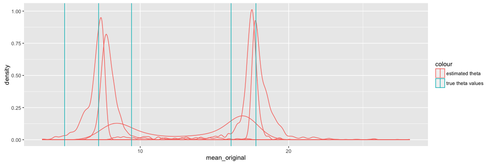
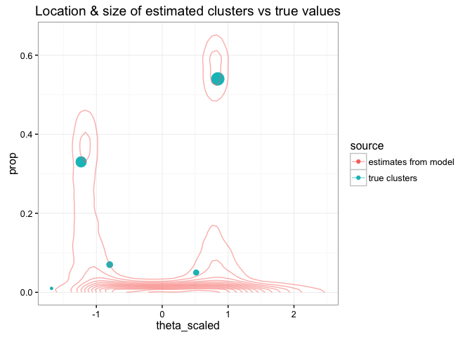
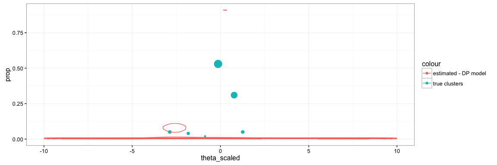

Purpose
-------

We're going to try out a few simple models using Dirichlet-process
priors, to see how they work in Stan.

Note that the first version of this document used a particular / fixed
seed to compare methods for a particular model. This revised version is
going to compare the methods for a number of iterations, since the best
method for a particular se

Generating some fake data
-------------------------

Here we're going to simulate some data according to the \[Chinese
Resaurant Process\]. This is described in this [blog
post](http://blog.datumbox.com/the-dirichlet-process-the-chinese-restaurant-process-and-other-representations/)
by [Vasilis Vryniotis](http://blog.datumbox.com/author/bbriniotis/).

    ## function to add a customer to a table
    add_customer <- function(thetas, alpha, base_function) {
      
      if (!exists('restaurant')) {
        ## start with an empty restaurant
        restaurant <<- data.frame(cust_id = integer(),
                             table_id = integer(),
                             theta = numeric(),
                             #value = numeric(),
                             NULL
                             )
        ## first customer sits at first table 
        cust <- 1
        table <- 1
        theta <- base_function()
      } else {
        # subsequent customers sometimes sit at new tables, sometimes join existing tables 
        num_prev_cust <- nrow(restaurant)
        num_curr_tables <- max(restaurant$table_id)
        cust <- num_prev_cust + 1
        prob_sit_new_table <- alpha / (num_prev_cust + alpha)
        sit_new_table <- rbinom(1,1,prob_sit_new_table)
        
        if (sit_new_table == 1) {
          table <- num_curr_tables + 1
          theta <- base_function()
        }
        else {
          table_counts <- restaurant %>% 
            group_by(table_id) %>%
            summarize(prob = n()/(num_prev_cust + alpha)
                      , theta = unique(theta)
                      ) %>%
            ungroup()
          selected_table <- table_counts %>% dplyr::filter(rmultinom(1, 1, table_counts$prob) == 1)
          table <- selected_table$table_id
          theta <- selected_table$theta
        }
      }  
        
      restaurant <<- restaurant %>%
        dplyr::bind_rows(list(cust_id = cust, table_id = table, theta = theta))
      return(TRUE)
    }

    # dispersion / parameter (alpha) - larger the value, more frequently new tables are spawned
    a <- 1

    ## Base function used to generate new values of theta
    g_base <- purrr::partial(rnorm, n = 1, mean = 10, sd = 5)

    rm(restaurant)
    for (i in 1:100) {
      add_customer(thetas = thetas, alpha = a, base_function = g_base)
    }

    ## summarize
    restaurant %>% 
      group_by(table_id) %>%
      summarize(n = n(),
                theta = unique(theta)
                )

    ## Source: local data frame [6 x 3]
    ## 
    ##   table_id     n     theta
    ##      (dbl) (int)     (dbl)
    ## 1        1    53 14.002771
    ## 2        2     5 17.793542
    ## 3        3     4  9.413790
    ## 4        4     5  6.565736
    ## 5        5     2 12.003857
    ## 6        6    31 16.473816

Next we add noise to our model, to simulate a more realistic
data-generating process

    noise_generator <- purrr::partial(rnorm, n = 1, mean = 0, sd = 1)

    restaurant <- restaurant %>%
      rowwise() %>%
      mutate(value = theta + noise_generator()) %>%
      ungroup()

    ggplot(restaurant, aes(x = value, group = table_id, colour = factor(table_id))) + geom_density()

<!-- -->

Rescaling data
--------------

Now, let's simulate the data analysis process which will be ignorant of
true cluster IDs.

First, we would rescale values according to observed mean & sd.

    restaurant <- restaurant %>%
      mutate(global_mean = mean(value),
             global_sd = sd(value),
             rescaled_value = (value - global_mean)/global_sd
             )

    ggplot(restaurant, aes(x = rescaled_value, group = table_id, colour = factor(table_id))) + geom_density()

<!-- -->

Defining the model
------------------

This is a first pass at fitting this model using Stan, as if it were a
simple mixture model.

    model_string <- "
    data {
      int n;
      real y[n];
      int K; ## presumed number of groups
    }

    parameters {
      simplex[K] proportions;
      ordered[K] theta; ## means for each group
      real<lower=0> sigma; ## overall sigma; does not vary by group
    }

    model {
      real ps[K]; ## temp holder for log component densities
      
      ## prior on thetas; normally distributed with mean 0 and sd 1
      theta ~ normal(0, 1);
      
      ## for now, no prior on proportions. Should prob be a dirichlet prior
      for (i in 1:n) {
        for (k in 1:K) {
          ps[k] <- log(proportions[k]) + normal_log(y[i], theta[k], sigma);
        }
        increment_log_prob(log_sum_exp(ps));
      }
    }

    "

Note that we've skipped the "generated quantities" block for now; means
we won't be able to do PP checks or run loo. We'll add it back in once
we have a model that works well.

Fitting the model in Stan
-------------------------

    iter <- 500
    seed <- 1235
    stan_samples <- stan(model_code = model_string,
                         iter = iter,
                         seed = seed,
                         data = list(y = restaurant$rescaled_value,
                                     n = nrow(restaurant),
                                     K = 5),
                         model_name = 'Simple mixture model with K = 5'
                         )

    # summarize outcome of interest
    print(stan_samples, pars = 'theta')

    ## Inference for Stan model: Simple mixture model with K = 5.
    ## 4 chains, each with iter=500; warmup=250; thin=1; 
    ## post-warmup draws per chain=250, total post-warmup draws=1000.
    ## 
    ##           mean se_mean   sd  2.5%   25%   50%   75% 97.5% n_eff Rhat
    ## theta[1] -2.54    0.01 0.17 -2.85 -2.65 -2.55 -2.44 -2.17   343 1.01
    ## theta[2] -0.31    0.05 0.36 -1.42 -0.40 -0.22 -0.10  0.15    48 1.09
    ## theta[3]  0.08    0.01 0.24 -0.31 -0.10  0.04  0.23  0.60   305 1.02
    ## theta[4]  0.40    0.02 0.27 -0.11  0.21  0.39  0.62  0.89   140 1.04
    ## theta[5]  0.78    0.01 0.26  0.34  0.63  0.77  0.90  1.34   528 1.01
    ## 
    ## Samples were drawn using NUTS(diag_e) at Wed May  4 11:59:54 2016.
    ## For each parameter, n_eff is a crude measure of effective sample size,
    ## and Rhat is the potential scale reduction factor on split chains (at 
    ## convergence, Rhat=1).

### Evaluating model fit

Review traceplot for theta - main parameter of interest

    traceplot(stan_samples, pars = 'theta')

<!-- -->

### Review 50 & 95% posterior density for theta

    plot(stan_samples, pars = 'theta')

<!-- -->

### Comparing estimated theta to true values

Next, since we are dealing with simulated data, we can compare the
values of our estimated parameter (*theta*) to the true value used to
generate the samples.

It's unlikely that the true value would be well outside our posterior
distribution for theta, but it's possible.

First we do some data-prep to collect & transform the values of theta
toput them on the original scale.

    ## true values, on original scale
    true_thetas <- unique(restaurant$theta)

    ## save, so we can transform thetahat to original scale
    global_mean <- unique(restaurant$global_mean)
    global_sd <- unique(restaurant$global_sd)

    # matrix of estimated values, on modified (rescaled) scale
    thetahat <- unlist(rstan::extract(stan_samples, 'theta')$theta)

    # modify into a dataset
    #rownames(thetahat) <- seq(from = 1, to = nrow(thetahat), by = 1)
    colnames(thetahat) <- seq(from = 1, to = 5, by = 1)
    thdata <- as.data.frame(thetahat) %>%
      mutate(iter = n()) %>%
      tidyr::gather(sample, mean_rescaled, 1:5, convert = T) %>%
      mutate(mean_original = (mean_rescaled * global_sd) + global_mean)

Next, we plot the observed & true means on the recentered scale

    library(ggplot2)
    ggplot() +
      geom_density(aes(x = mean_rescaled, group = sample, colour = 'estimated theta'), data = thdata) +
      geom_vline(aes(xintercept = mean, colour = 'true theta values'), data = restaurant %>% group_by(table_id) %>% summarize(mean = mean(rescaled_value, na.rm = T)) %>% ungroup())

<!-- -->

And, the observed vs true estimates of theta

    library(ggplot2)
    ggplot() +
      geom_density(aes(x = mean_original, group = sample, colour = 'estimated theta'), data = thdata) +
      geom_vline(aes(xintercept = true_thetas, colour = 'true theta values'))

<!-- -->

We notice that even though we have constrained the values of theta to be
ordered, there are still some label-switching problems.

IE each 'sample' has a multi-modal distribution of theta. Collapsing
these may yield a more complete picture.

    library(ggplot2)
    ggplot() +
      geom_density(aes(x = mean_original, colour = 'estimated theta'), data = thdata) +
      geom_vline(aes(xintercept = true_thetas, colour = 'true theta values'))

<!-- -->

Notice how the smoothed estimates look more consistent with a 3-cluster
result (ie K = 3), rather than the true value (K = 5).

Let's see if Loo can help us distinguish between different values of K.

Using Loo to find optimal values of K
-------------------------------------

[Loo](http://www.stat.columbia.edu/~gelman/research/unpublished/loo_stan.pdf)
approximates leave-one-out validation, and can be used to identify
observations with undue influence (leverage) on the model and/or for
model comparison.

In this case, we will use Loo for sanity checking & to compare model fit
under different values of K.

### Adding the generated quantities block

In order to use Loo, we need to first calculate the log\_liklihood in
the generated quantities block.

Our revised model string will look like this:

    model_string_with_loglik <- "
    data {
      int n;
      real y[n];
      int K; ## presumed number of groups
    }

    parameters {
      simplex[K] proportions;
      ordered[K] theta; ## means for each group
      real<lower=0> sigma; ## overall sigma; does not vary by group
    }

    model {
      ## prior on thetas; normally distributed with mean 0 and sd 1
      theta ~ normal(0, 1);
      
      ## for now, no prior on proportions. Should prob be a dirichlet prior
      for (i in 1:n) {
        real ps[K]; ## temp holder for log component densities
        for (k in 1:K) {
          ps[k] <- log(proportions[k]) + normal_log(y[i], theta[k], sigma);
        }
        increment_log_prob(log_sum_exp(ps));
      }
    }

    generated quantities {
      real log_lik[n];
      
      for (i in 1:n) {
        real ps[K]; ## temp holder for log component densities
        for (k in 1:K) {
          ps[k] <- log(proportions[k]) + normal_log(y[i], theta[k], sigma);
        }
        log_lik[i] <- log_sum_exp(ps);
      }
    }
    "

Let's do a quick sanity check to see if the model works as it did
before.

    stan_samples_k5 <- stan(model_code = model_string_with_loglik,
                         iter = iter,
                         seed = seed,
                         data = list(y = restaurant$rescaled_value,
                                     n = nrow(restaurant),
                                     K = 5),
                         model_name = 'Simple mixture model with K = 5 (v2)'
                         )

    # summarize outcome of interest
    print(stan_samples_k5, pars = 'theta')

    ## Inference for Stan model: Simple mixture model with K = 5 (v2).
    ## 4 chains, each with iter=500; warmup=250; thin=1; 
    ## post-warmup draws per chain=250, total post-warmup draws=1000.
    ## 
    ##           mean se_mean   sd  2.5%   25%   50%   75% 97.5% n_eff Rhat
    ## theta[1] -2.54    0.01 0.17 -2.85 -2.65 -2.55 -2.44 -2.17   343 1.01
    ## theta[2] -0.31    0.05 0.36 -1.42 -0.40 -0.22 -0.10  0.15    48 1.09
    ## theta[3]  0.08    0.01 0.24 -0.31 -0.10  0.04  0.23  0.60   305 1.02
    ## theta[4]  0.40    0.02 0.27 -0.11  0.21  0.39  0.62  0.89   140 1.04
    ## theta[5]  0.78    0.01 0.26  0.34  0.63  0.77  0.90  1.34   528 1.01
    ## 
    ## Samples were drawn using NUTS(diag_e) at Wed May  4 12:00:49 2016.
    ## For each parameter, n_eff is a crude measure of effective sample size,
    ## and Rhat is the potential scale reduction factor on split chains (at 
    ## convergence, Rhat=1).

### Loo with k = 5

    loo_k5 <- loo(rstan::extract(stan_samples_k5, 'log_lik')$log_lik)

### Estimating model with k = 3, 4, and 5

(note: output is hidden for sake of brevity)

    ## K = 2
    stan_samples_k2 <- stan(model_code = model_string_with_loglik,
                         iter = iter,
                         seed = seed,
                         data = list(y = restaurant$rescaled_value,
                                     n = nrow(restaurant),
                                     K = 2),
                         model_name = 'Simple mixture model with K = 2 (v2)'
                         )

    print(stan_samples_k2, pars = 'theta')
    loo_k2 <- loo(rstan::extract(stan_samples_k2, 'log_lik')$log_lik)

    ## K = 3
    stan_samples_k3 <- stan(model_code = model_string_with_loglik,
                         iter = iter,
                         seed = seed,
                         data = list(y = restaurant$rescaled_value,
                                     n = nrow(restaurant),
                                     K = 3),
                         model_name = 'Simple mixture model with K = 3 (v2)'
                         )

    print(stan_samples_k3, pars = 'theta')
    loo_k3 <- loo(rstan::extract(stan_samples_k3, 'log_lik')$log_lik)

    ## K = 4
    stan_samples_k4 <- stan(model_code = model_string_with_loglik,
                         iter = iter,
                         seed = seed,
                         data = list(y = restaurant$rescaled_value,
                                     n = nrow(restaurant),
                                     K = 4),
                         model_name = 'Simple mixture model with K = 4 (v2)'
                         )

    # summarize outcome of interest
    print(stan_samples_k4, pars = 'theta')
    loo_k4 <- loo(rstan::extract(stan_samples_k4, 'log_lik')$log_lik)

### Comparing model fit using Loo

Note that higher values of elpd\_loo are better -- so the first model
listed here is likely the "best" fit.

    loo::compare(loo_k2, loo_k3, loo_k4, loo_k5)

    ##        looic  se_looic elpd_loo se_elpd_loo p_loo  se_p_loo
    ## loo_k4  237.6   16.5   -118.8      8.3         4.6    0.8  
    ## loo_k3  238.7   16.8   -119.4      8.4         4.8    0.8  
    ## loo_k5  239.0   16.8   -119.5      8.4         5.1    0.8  
    ## loo_k2  239.1   16.9   -119.6      8.4         3.6    0.6

The relative differences between the models with k = 3, 4, and 5 are
fairly small, however.

The biggest gain is seen between models with K = 2 vs K = 3:

    loo::compare(loo_k2, loo_k3)

    ## elpd_diff        se 
    ##       0.2       0.7

Looking at K = 3 vs K = 4, however, the difference is minimal:

    loo::compare(loo_k3, loo_k4)

    ## elpd_diff        se 
    ##       0.6       0.2

And, actually worsens for K = 4 vs K = 5

    loo::compare(loo_k4, loo_k5)

    ## elpd_diff        se 
    ##      -0.7       0.2

Based on these results, the best fits have K = 3 or K = 4. Ideal result
will likely be an average of the two models.

Improving the model using Dirichlet prior
-----------------------------------------

Now that we have a reasonably-well-fitting mixture model, let's see how
this can be improved by incorporating a Dirichlet (process) prior. This
is not a pure non-parametric implementation, since we are specifying the
max possible number of groups (K) but it should get us close.

Since our data were generated according to a dirichlet process (at least
we think they were!), it's plausible that this prior may yield a
distribution of group sizes that better match our data.

    model_string_with_dp <- "
    data {
      int n;
      real y[n];
      int K; ## presumed number of groups
    }

    parameters {
      simplex[K] proportions;  ## mixing proportion (pis)
      ordered[K] theta;        ## means for each group
      real<lower=0> sigma;     ## overall sigma; does not vary by group
      real<lower=0> a;         ## concentration parameter
    }

    transformed parameters {
      vector<lower=0>[K] alpha;
      for (k in 1:K) {
        alpha[k] <- a/k;
      }
    }

    model {
      ## priors on parameters
      theta ~ normal(0, 1);
      a ~ normal(10,10);
      proportions ~ dirichlet(alpha);
      
      ## compute likelihood for each observation, integrating out discrete-ness of groups
      for (i in 1:n) {
        real ps[K]; ## temp holder for log component densities
        for (k in 1:K) {
          ps[k] <- log(proportions[k]) + normal_log(y[i], theta[k], sigma);
        }
        increment_log_prob(log_sum_exp(ps));
      }
    }

    generated quantities {
      real log_lik[n];
      
      for (i in 1:n) {
        real ps[K]; ## temp holder for log component densities
        for (k in 1:K) {
          ps[k] <- log(proportions[k]) + normal_log(y[i], theta[k], sigma);
        }
        log_lik[i] <- log_sum_exp(ps);
      }
    }
    "

### Fitting Dirichlet-prior model to data

Try fitting this revised model to our data. For now, start with K = 5
since that's the "ground truth"

    stan_samples_dp <- stan(model_code = model_string_with_dp,
                         iter = iter*2,
                         seed = seed,
                         data = list(y = restaurant$rescaled_value,
                                     n = nrow(restaurant),
                                     K = 5),
                         control = list(adapt_delta = 0.95, max_treedepth = 13),
                         model_name = 'Simple mixture model with Dirichlet prior (K = 5)'
                         )

    ## look at thetas
    print(stan_samples_dp, pars = c('theta'))

    ## Inference for Stan model: Simple mixture model with Dirichlet prior (K = 5).
    ## 4 chains, each with iter=1000; warmup=500; thin=1; 
    ## post-warmup draws per chain=500, total post-warmup draws=2000.
    ## 
    ##           mean se_mean   sd  2.5%   25%   50%   75% 97.5% n_eff Rhat
    ## theta[1] -2.52    0.01 0.17 -2.84 -2.64 -2.53 -2.42 -2.15   855 1.00
    ## theta[2] -0.30    0.03 0.45 -1.57 -0.37 -0.18 -0.03  0.22   250 1.02
    ## theta[3]  0.14    0.02 0.31 -0.57 -0.03  0.17  0.33  0.71   415 1.01
    ## theta[4]  0.51    0.01 0.30 -0.07  0.31  0.51  0.71  1.11   534 1.01
    ## theta[5]  0.96    0.01 0.44  0.31  0.70  0.87  1.13  2.13  1111 1.00
    ## 
    ## Samples were drawn using NUTS(diag_e) at Wed May  4 12:02:11 2016.
    ## For each parameter, n_eff is a crude measure of effective sample size,
    ## and Rhat is the potential scale reduction factor on split chains (at 
    ## convergence, Rhat=1).

Here I should mention that we increased the number of iterations, and
increased the values of adapt\_delta & max\_treedepth. These settings
were determined through trial and error.

### compare dp-derived model to the simple mixture model

Comparing the two models using *loo* yields some differences in overall
predictive accuracy. The simple mixture model does appear to fit these
data better than the DP process.

    loo_dp <- loo(rstan::extract(stan_samples_dp,'log_lik')$log_lik)
    loo::compare(loo_dp, loo_k4, loo_k5)

    ##        looic  se_looic elpd_loo se_elpd_loo p_loo  se_p_loo
    ## loo_k4  237.6   16.5   -118.8      8.3         4.6    0.8  
    ## loo_dp  238.9   16.2   -119.4      8.1         4.8    0.8  
    ## loo_k5  239.0   16.8   -119.5      8.4         5.1    0.8

    loo::compare(loo_dp, loo_k4)

    ## elpd_diff        se 
    ##       0.6       0.2

Let's see what happens with the DP model if we increase the number of
groups to, say, K = 10.

    stan_samples_dp_k10 <- stan(model_code = model_string_with_dp,
                         iter = iter*2,
                         seed = seed,
                         data = list(y = restaurant$rescaled_value,
                                     n = nrow(restaurant),
                                     K = 10),
                         control = list(adapt_delta = 0.95, max_treedepth = 13),
                         model_name = 'Simple mixture model with Dirichlet prior'
                         )

    print(stan_samples_dp_k10, pars = c('theta'))

    ## Inference for Stan model: Simple mixture model with Dirichlet prior (K = 5).
    ## 4 chains, each with iter=1000; warmup=500; thin=1; 
    ## post-warmup draws per chain=500, total post-warmup draws=2000.
    ## 
    ##            mean se_mean   sd  2.5%   25%   50%   75% 97.5% n_eff Rhat
    ## theta[1]  -2.56    0.01 0.17 -2.92 -2.66 -2.56 -2.46 -2.25   413 1.01
    ## theta[2]  -0.62    0.06 0.62 -2.24 -0.82 -0.37 -0.22  0.04   116 1.03
    ## theta[3]  -0.24    0.02 0.37 -1.23 -0.33 -0.16 -0.02  0.25   240 1.02
    ## theta[4]  -0.01    0.02 0.28 -0.73 -0.15  0.01  0.17  0.46   329 1.01
    ## theta[5]   0.19    0.01 0.27 -0.37  0.03  0.21  0.37  0.68   398 1.01
    ## theta[6]   0.37    0.01 0.26 -0.16  0.21  0.38  0.55  0.84   593 1.01
    ## theta[7]   0.56    0.01 0.25  0.06  0.39  0.57  0.73  1.03   865 1.00
    ## theta[8]   0.75    0.01 0.25  0.26  0.58  0.74  0.91  1.28  1424 1.00
    ## theta[9]   0.99    0.01 0.32  0.46  0.78  0.94  1.15  1.73  1801 1.00
    ## theta[10]  1.43    0.01 0.51  0.69  1.06  1.34  1.70  2.67  1491 1.00
    ## 
    ## Samples were drawn using NUTS(diag_e) at Wed May  4 12:09:05 2016.
    ## For each parameter, n_eff is a crude measure of effective sample size,
    ## and Rhat is the potential scale reduction factor on split chains (at 
    ## convergence, Rhat=1).

In this case, we're a lot less interested in what happens to the thetas
than the proportions.

    print(stan_samples_dp_k10, pars = c('theta'))

    ## Inference for Stan model: Simple mixture model with Dirichlet prior (K = 5).
    ## 4 chains, each with iter=1000; warmup=500; thin=1; 
    ## post-warmup draws per chain=500, total post-warmup draws=2000.
    ## 
    ##            mean se_mean   sd  2.5%   25%   50%   75% 97.5% n_eff Rhat
    ## theta[1]  -2.56    0.01 0.17 -2.92 -2.66 -2.56 -2.46 -2.25   413 1.01
    ## theta[2]  -0.62    0.06 0.62 -2.24 -0.82 -0.37 -0.22  0.04   116 1.03
    ## theta[3]  -0.24    0.02 0.37 -1.23 -0.33 -0.16 -0.02  0.25   240 1.02
    ## theta[4]  -0.01    0.02 0.28 -0.73 -0.15  0.01  0.17  0.46   329 1.01
    ## theta[5]   0.19    0.01 0.27 -0.37  0.03  0.21  0.37  0.68   398 1.01
    ## theta[6]   0.37    0.01 0.26 -0.16  0.21  0.38  0.55  0.84   593 1.01
    ## theta[7]   0.56    0.01 0.25  0.06  0.39  0.57  0.73  1.03   865 1.00
    ## theta[8]   0.75    0.01 0.25  0.26  0.58  0.74  0.91  1.28  1424 1.00
    ## theta[9]   0.99    0.01 0.32  0.46  0.78  0.94  1.15  1.73  1801 1.00
    ## theta[10]  1.43    0.01 0.51  0.69  1.06  1.34  1.70  2.67  1491 1.00
    ## 
    ## Samples were drawn using NUTS(diag_e) at Wed May  4 12:09:05 2016.
    ## For each parameter, n_eff is a crude measure of effective sample size,
    ## and Rhat is the potential scale reduction factor on split chains (at 
    ## convergence, Rhat=1).

And, let's compare the combination of proportion & theta to our original
data.

    ## weighted distribution of true values of theta
    true_theta <- 
      restaurant %>%
      mutate(theta_scaled = (theta - global_mean)/global_sd
             , global_n = n()
             ) %>%
      group_by(table_id) %>%
      summarize(theta_scaled = unique(theta_scaled)
                , prop = unique(n()/global_n)
                ) %>%
      ungroup()

    ## weighted distribution of estimated values of theta from DP model
    estimated_theta_dp <- 
      rstan::extract(stan_samples_dp_k10,'theta')$theta %>%
      as.data.frame(.)
    names(estimated_theta_dp) <- 1:10
    estimated_theta_dp <- 
      estimated_theta_dp %>%
      mutate(iter = 1:n()) %>%
      gather(cluster_id, theta_scaled, 1:10, convert = T) 

    estimated_prop_dp <- 
      rstan::extract(stan_samples_dp_k10, 'proportions')$proportions %>%
      as.data.frame(.)
    names(estimated_prop_dp) <- 1:10
    estimated_prop_dp <- 
      estimated_prop_dp %>%
      mutate(iter = 1:n()) %>%
      gather(cluster_id, prop, 1:10, convert = T)

    estimated_dp <- 
      estimated_theta_dp %>%
      inner_join(estimated_prop_dp
                 , by = c('cluster_id','iter')
                 )

    ggplot() +
      geom_point(data = true_theta
                 , mapping = aes(x = theta_scaled, y = prop, size = prop, colour = 'true clusters', fill = 'true clusters')
                 ) +
      geom_density_2d(data = estimated_dp, mapping = aes(x = theta_scaled, y = prop, colour = 'estimated - DP model', fill = 'estimated - DP model')) + 
      scale_fill_discrete(guide = "none") +
      scale_size_continuous(guide = "none") +
      theme_bw()

<!-- -->

Let's compare this to the same computation using the simple mixture
model with K = 4

    ## weighted distribution of estimated values of theta from (k4) mixture model
    estimated_theta_mix <- 
      rstan::extract(stan_samples_k4,'theta')$theta %>%
      as.data.frame(.)
    names(estimated_theta_mix) <- 1:4
    estimated_theta_mix <- 
      estimated_theta_mix %>%
      mutate(iter = 1:n()) %>%
      gather(cluster_id, theta_scaled, 1:4, convert = T) 

    estimated_prop_mix <- 
      rstan::extract(stan_samples_k4, 'proportions')$proportions %>%
      as.data.frame(.)
    names(estimated_prop_mix) <- 1:4
    estimated_prop_mix <- 
      estimated_prop_mix %>%
      mutate(iter = 1:n()) %>%
      gather(cluster_id, prop, 1:4, convert = T)

    estimated_mix <- 
      estimated_theta_mix %>%
      inner_join(estimated_prop_mix
                 , by = c('cluster_id','iter')
                 )

    ggplot() +
      geom_point(data = true_theta
                 , mapping = aes(x = theta_scaled, y = prop, size = prop, colour = 'true clusters', fill = 'true clusters')
                 ) +
      geom_density_2d(data = estimated_dp, mapping = aes(x = theta_scaled, y = prop, colour = 'estimated - DP model')) +
      geom_density_2d(data = estimated_mix, mapping = aes(x = theta_scaled, y = prop, colour = 'estimated - k4 mixture model')) +
      scale_fill_discrete(guide = "none") +
      scale_size_continuous(guide = "none") +
      theme_bw()

<!-- -->

My guess is, the reason why we're seeing this vestigial cluster at theta
= 0 is due to our prior -- this is set to be gaussian with mean 0 and sd
of 1.

Let's try relaxing this prior to place less bias on the 0-valued thetas.

Improving the model by adjusting the priors on theta
----------------------------------------------------

While we're at it, let's make a second modification to our model since
there is an additional constraint that may not be necessary (or
tenable)..

Namely, the original mixture model forced the thetas to be "ordered" --
without this constraint all clusters would be exchangeable & so we'd
have too much class switching (we still have class switching but less of
it).

In this model, forcing the *means* to be ordered is problematic because
we have additionally imposed some order on the *size* of each cluster,
via the prior on the proportions parameter. There is no reason to think
that the largest clusters will also have the smallest means, and so we
should now relax one of these two constraints.

Thus, to summarize, we will make two modifications to our model based on
the observations above -- 1. allow priors on theta to be passed in as
parameters 2. remove *ordered* parameter on the thetas - make this
simply be a vector.

Let's see how well this revised model fits our data.

    model_string_with_dp2 <- "
    data {
      int n;
      real y[n];
      int K; ## presumed number of groups
      real prior_theta_mean;
      real prior_theta_sd;
    }

    parameters {
      simplex[K] proportions;  ## mixing proportion (pis)
      vector[K] theta;           ## means for each group
      real<lower=0> sigma;     ## overall sigma; does not vary by group
      real<lower=0> a;         ## concentration parameter
    }

    transformed parameters {
      vector<lower=0>[K] alpha;
      for (k in 1:K) {
        alpha[k] <- a/k;
      }
    }

    model {
      ## priors on parameters
      theta ~ normal(prior_theta_mean, prior_theta_sd);
      a ~ normal(10, 10);
      proportions ~ dirichlet(alpha);
      
      ## compute likelihood for each observation, integrating out discrete-ness of groups
      for (i in 1:n) {
        real ps[K]; ## temp holder for log component densities
        for (k in 1:K) {
          ps[k] <- log(proportions[k]) + normal_log(y[i], theta[k], sigma);
        }
        increment_log_prob(log_sum_exp(ps));
      }
    }

    generated quantities {
      real log_lik[n];
      
      for (i in 1:n) {
        real ps[K]; ## temp holder for log component densities
        for (k in 1:K) {
          ps[k] <- log(proportions[k]) + normal_log(y[i], theta[k], sigma);
        }
        log_lik[i] <- log_sum_exp(ps);
      }
    }
    "

### Fitting adustable-prior model to data

Try fitting this revised model to our data. For now, start with K = 10
since that's what we did previously. We will increase the
prior\_theta\_sd to 5 to give this some more breathing room (recall that
our data are rescaled so 5 is quite large!).

    stan_samples_dp2 <- stan(model_code = model_string_with_dp2
                             , iter = iter*2
                             , seed = seed
                             , data = list(y = restaurant$rescaled_value
                                           , n = nrow(restaurant)
                                           , K = 10
                                           , prior_theta_mean = 0
                                           , prior_theta_sd = 5
                                           )
                             , control = list(adapt_delta = 0.98, max_treedepth = 15)
                             , model_name = 'Simple mixture model with Dirichlet prior'
                             )

    ## look at thetas
    print(stan_samples_dp2, pars = c('theta'))

    ## Inference for Stan model: Simple mixture model with Dirichlet prior.
    ## 4 chains, each with iter=1000; warmup=500; thin=1; 
    ## post-warmup draws per chain=500, total post-warmup draws=2000.
    ## 
    ##            mean se_mean   sd  2.5%   25%   50%  75% 97.5% n_eff Rhat
    ## theta[1]  -0.15    0.19 1.77 -3.90 -0.24  0.14 0.51  2.53    85 1.06
    ## theta[2]  -0.25    0.17 2.47 -5.53 -1.38  0.09 0.66  5.62   211 1.02
    ## theta[3]  -0.57    0.19 3.11 -7.31 -2.53 -0.19 0.72  6.73   264 1.02
    ## theta[4]  -0.37    0.17 3.60 -8.22 -2.56 -0.09 1.03  8.02   466 1.01
    ## theta[5]  -0.40    0.21 4.04 -8.53 -2.60 -0.30 1.12  9.02   368 1.00
    ## theta[6]  -0.13    0.16 4.03 -8.35 -2.60 -0.19 1.66  8.99   635 1.00
    ## theta[7]  -0.19    0.16 4.08 -9.31 -2.53 -0.16 1.39  9.21   652 1.01
    ## theta[8]  -0.14    0.16 4.17 -8.42 -2.84 -0.01 2.03  9.07   652 1.00
    ## theta[9]  -0.70    0.19 4.14 -8.39 -3.02 -0.98 1.38  8.31   490 1.00
    ## theta[10] -0.23    0.21 4.38 -9.17 -2.74 -0.41 1.94  9.12   438 1.00
    ## 
    ## Samples were drawn using NUTS(diag_e) at Wed May  4 12:11:27 2016.
    ## For each parameter, n_eff is a crude measure of effective sample size,
    ## and Rhat is the potential scale reduction factor on split chains (at 
    ## convergence, Rhat=1).

Note also that we have increased the adapt delta & max\_treedepth yet
again, based on repeated runs of this model.

### Comparing estimated thetas to known truth

Now let's compare the distribution of thetas from this revised model to
the ground truth.

(we're also going to re-write this into a function since it's likely
we'll be using it again.)

    get_sampled_parameter <- function(stanfit, pars, parameter_id = 'parameter_id', parameter_value = 'parameter_value') {
      estimated_pars <- 
        rstan::extract(object = stanfit, pars = pars)[[1]] %>%
        as.data.frame(.)
      
      names(estimated_pars) <- seq_len(ncol(estimated_pars))
      
      vars_to_rename <- list('parameter_id', 'parameter_value')
      names(vars_to_rename) <- c(parameter_id, parameter_value)
      
      estimated_pars %>%
        mutate(iter = 1:n()) %>%
        gather(parameter_id, parameter_value, -iter, convert = T) %>%
        rename_(.dots = vars_to_rename)
    }

    estimated_prop_dp2 <- get_sampled_parameter(stan_samples_dp2, 'proportions', parameter_id = 'cluster_id', parameter_value = 'prop')
    estimated_theta_dp2 <- get_sampled_parameter(stan_samples_dp2, 'theta', parameter_id = 'cluster_id', parameter_value = 'theta_scaled')

    estimated_dp2 <- 
      estimated_theta_dp2 %>%
      inner_join(estimated_prop_dp2
                 , by = c('cluster_id','iter')
                 )

    ggplot() +
      geom_point(data = true_theta
                 , mapping = aes(x = theta_scaled, y = prop, size = prop, colour = 'true clusters', fill = 'true clusters')
                 ) +
      scale_fill_discrete(guide = "none") +
      scale_size_continuous(guide = "none") +
      geom_density_2d(data = estimated_dp2, mapping = aes(x = theta_scaled, y = prop, colour = 'estimated - DP model')) +
      theme_bw()

<!-- -->

Hmm.. Its pretty obvious that the priors on theta are way too strong,
even though the clusters have minimal size.

It also seems like we want to have an even more strongly diminishing
likelihood of new clusters - maybe put a stronger prior on the
`{r, eval = F} a` parameter.

Improving the model by adjusting priors on a and theta
------------------------------------------------------

Now we're going to modify the model again by removing priors on theta &
modifying the prior on a to be stronger.

Recall that we set `{r eval = F} a` to `{r eval = T} a` initially. How
close is this to our estimate?

    print(stan_samples_dp2, pars = 'a')

    ## Inference for Stan model: Simple mixture model with Dirichlet prior.
    ## 4 chains, each with iter=1000; warmup=500; thin=1; 
    ## post-warmup draws per chain=500, total post-warmup draws=2000.
    ## 
    ##   mean se_mean   sd 2.5% 25%  50%  75% 97.5% n_eff Rhat
    ## a 3.32    0.92 5.06 0.11 0.5 1.16 3.96 18.42    30 1.16
    ## 
    ## Samples were drawn using NUTS(diag_e) at Wed May  4 12:11:27 2016.
    ## For each parameter, n_eff is a crude measure of effective sample size,
    ## and Rhat is the potential scale reduction factor on split chains (at 
    ## convergence, Rhat=1).

    estimated_a_dp2 <- get_sampled_parameter(stan_samples_dp2, 'a')
    ggplot() +
      geom_density(data = estimated_a_dp2, aes(x = log1p(parameter_value), colour = 'estimated values')) + 
      geom_vline(aes(xintercept = log1p(a), colour = 'true value'))

<!-- -->

Nice - this seems to be a reasonable estimate.

Let's write a revised version of this model, so that we can modify the
priors on a.

    model_string_with_dp3 <- "
    data {
      int n;
      real y[n];
      int K; ## presumed number of groups
      real prior_theta_mean;
      real prior_theta_sd;
      real prior_a_mean;
      real prior_a_sd;
    }

    parameters {
      simplex[K] proportions;  ## mixing proportion (pis)
      vector[K] theta;           ## means for each group
      real<lower=0> sigma;     ## overall sigma; does not vary by group
      real<lower=0> a;         ## concentration parameter
    }

    transformed parameters {
      vector<lower=0>[K] alpha;
      for (k in 1:K) {
        alpha[k] <- a/k;
      }
    }

    model {
      ## priors on parameters
      theta ~ normal(prior_theta_mean, prior_theta_sd);
      a ~ normal(prior_a_mean, prior_a_sd);
      proportions ~ dirichlet(alpha);
      
      ## compute likelihood for each observation, integrating out discrete-ness of groups
      for (i in 1:n) {
        real ps[K]; ## temp holder for log component densities
        for (k in 1:K) {
          ps[k] <- log(proportions[k]) + normal_log(y[i], theta[k], sigma);
        }
        increment_log_prob(log_sum_exp(ps));
      }
    }

    generated quantities {
      real log_lik[n];
      
      for (i in 1:n) {
        real ps[K]; ## temp holder for log component densities
        for (k in 1:K) {
          ps[k] <- log(proportions[k]) + normal_log(y[i], theta[k], sigma);
        }
        log_lik[i] <- log_sum_exp(ps);
      }
    }
    "

### Fitting revised model

    stan_samples_dp3 <- stan(model_code = model_string_with_dp3
                             , iter = iter*2
                             , seed = seed
                             , data = list(y = restaurant$rescaled_value
                                           , n = nrow(restaurant)
                                           , K = 10
                                           , prior_theta_mean = 0
                                           , prior_theta_sd = 1
                                           , prior_a_mean = 0
                                           , prior_a_sd = 1
                                           )
                             , control = list(adapt_delta = 0.98, max_treedepth = 15)
                             , model_name = 'Simple mixture model with Dirichlet prior'
                             )

    ## look at thetas
    print(stan_samples_dp3, pars = c('theta','a'))

    ## Inference for Stan model: Simple mixture model with Dirichlet prior.
    ## 4 chains, each with iter=1000; warmup=500; thin=1; 
    ## post-warmup draws per chain=500, total post-warmup draws=2000.
    ## 
    ##            mean se_mean   sd  2.5%   25%   50%  75% 97.5% n_eff Rhat
    ## theta[1]  -0.11    0.33 1.03 -2.67 -0.19  0.16 0.51  1.01     9 1.72
    ## theta[2]  -0.27    0.24 1.19 -2.70 -0.55  0.04 0.52  1.29    24 1.09
    ## theta[3]  -0.27    0.14 1.18 -2.75 -0.64  0.02 0.53  1.43    68 1.05
    ## theta[4]  -0.17    0.09 1.16 -2.75 -0.59  0.05 0.61  1.55   152 1.06
    ## theta[5]  -0.22    0.10 1.13 -2.65 -0.82  0.00 0.58  1.60   130 1.02
    ## theta[6]  -0.31    0.19 1.26 -2.75 -0.97 -0.04 0.60  1.68    42 1.06
    ## theta[7]  -0.24    0.13 1.22 -2.71 -0.91 -0.05 0.59  1.71    96 1.06
    ## theta[8]   0.00    0.06 0.97 -2.40 -0.52  0.05 0.66  1.81   263 1.02
    ## theta[9]  -0.21    0.09 1.15 -2.66 -0.81 -0.04 0.60  1.68   160 1.02
    ## theta[10] -0.03    0.06 1.06 -2.55 -0.59  0.05 0.65  1.86   309 1.00
    ## a          1.05    0.05 0.58  0.21  0.60  0.95 1.43  2.40   125 1.03
    ## 
    ## Samples were drawn using NUTS(diag_e) at Wed May  4 12:15:04 2016.
    ## For each parameter, n_eff is a crude measure of effective sample size,
    ## and Rhat is the potential scale reduction factor on split chains (at 
    ## convergence, Rhat=1).

### comparing estimates of theta to known values

Now, repeating the process above, we look at similarity of thetas to
known values (weighted by proportion)

    estimated_prop_dp3 <- get_sampled_parameter(stan_samples_dp3, 'proportions', parameter_id = 'cluster_id', parameter_value = 'prop')
    estimated_theta_dp3 <- get_sampled_parameter(stan_samples_dp3, 'theta', parameter_id = 'cluster_id', parameter_value = 'theta_scaled')

    estimated_dp3 <- 
      estimated_theta_dp3 %>%
      inner_join(estimated_prop_dp3
                 , by = c('cluster_id','iter')
                 )

    ggplot() +
      geom_point(data = true_theta
                 , mapping = aes(x = theta_scaled, y = prop, size = prop, colour = 'true clusters', fill = 'true clusters')
                 ) +
      scale_fill_discrete(guide = "none") +
      scale_size_continuous(guide = "none") +
      geom_density_2d(data = estimated_dp3, mapping = aes(x = theta_scaled, y = prop, colour = 'estimated - DP model')) +
      theme_bw()

<!-- -->

### comparing estimates of a to known value

And, look again at the distribution of values of a.

    estimated_a_dp3 <- get_sampled_parameter(stan_samples_dp3, 'a')
    ggplot() +
      geom_density(data = estimated_a_dp3, aes(x = log1p(parameter_value), colour = 'estimated values')) + 
      geom_vline(aes(xintercept = log1p(a), colour = 'true value'))

<!-- -->

In general, it seems like we have too little data & thus our estimates
are heavily influenced by our priors.

### Comparing this model's performance to the k4 model

    loo_dp3 <- loo(rstan::extract(stan_samples_dp3, 'log_lik')$log_lik)
    loo::compare(loo_dp3, loo_k4)

    ## elpd_diff        se 
    ##       0.8       0.3

At this point, the k4 model is only marginally better than this "dp3"
model.

Just for kicks, let's try a uniform prior on the thetas to see how this
model does.

Model with uniform prior on thetas
----------------------------------

Now we're going to try a similar model but remove the prior on the
thetas to be basically non-informative.

For sake of sampling efficiency, we will want to bound the values of
theta so that the sampler doesn't have to explore the entire sample
space -- without a prior, values as large as 1000 as just as plausible
as those close to 0.

This is not an optimal approach in general, but in our case isn't
terrible since we will be applying these data to a constrained \[0,1\]
sample space in practice.

Here is the revised model code:

    model_string_with_dp4 <- "
    data {
      int n;
      real y[n];
      int K; ## presumed number of groups
      real prior_a_mean;
      real prior_a_sd;
    }

    parameters {
      simplex[K] proportions;  ## mixing proportion (pis)
      vector<lower=-10,upper=10>[K] theta;           ## means for each group
      real<lower=0> sigma;     ## overall sigma; does not vary by group
      real<lower=0> a;         ## concentration parameter
    }

    transformed parameters {
      vector<lower=0>[K] alpha;
      for (k in 1:K) {
        alpha[k] <- a/k;
      }
    }

    model {
      ## priors on parameters
      a ~ normal(prior_a_mean, prior_a_sd);
      proportions ~ dirichlet(alpha);
      
      ## compute likelihood for each observation, integrating out discrete-ness of groups
      for (i in 1:n) {
        real ps[K]; ## temp holder for log component densities
        for (k in 1:K) {
          ps[k] <- log(proportions[k]) + normal_log(y[i], theta[k], sigma);
        }
        increment_log_prob(log_sum_exp(ps));
      }
    }

    generated quantities {
      real log_lik[n];
      
      for (i in 1:n) {
        real ps[K]; ## temp holder for log component densities
        for (k in 1:K) {
          ps[k] <- log(proportions[k]) + normal_log(y[i], theta[k], sigma);
        }
        log_lik[i] <- log_sum_exp(ps);
      }
    }
    "

### Fitting revised model

Next we fit this model to data, leaving most of the parameters as
before.

    stan_samples_dp4 <- stan(model_code = model_string_with_dp4
                             , iter = iter*2
                             , seed = seed
                             , data = list(y = restaurant$rescaled_value
                                           , n = nrow(restaurant)
                                           , K = 10
                                           , prior_a_mean = 0
                                           , prior_a_sd = 1
                                           )
                             , control = list(adapt_delta = 0.98, max_treedepth = 15)
                             , model_name = 'Simple mixture model with Dirichlet prior'
                             )

    ## look at thetas
    print(stan_samples_dp4, pars = c('theta','a'))

    ## Inference for Stan model: Simple mixture model with Dirichlet prior.
    ## 4 chains, each with iter=1000; warmup=500; thin=1; 
    ## post-warmup draws per chain=500, total post-warmup draws=2000.
    ## 
    ##            mean se_mean   sd  2.5%   25%   50%  75% 97.5% n_eff Rhat
    ## theta[1]   0.00    0.48 2.71 -5.89 -0.24  0.24 0.37  8.58    32 1.11
    ## theta[2]  -0.60    0.23 4.06 -8.67 -2.68 -0.28 0.72  8.90   314 1.01
    ## theta[3]  -0.61    0.19 4.71 -9.58 -2.93 -0.74 1.58  8.95   604 1.00
    ## theta[4]  -0.33    0.23 5.38 -9.50 -3.62 -0.55 3.59  9.61   529 1.00
    ## theta[5]  -0.53    0.25 5.38 -9.47 -4.34 -0.99 3.51  9.21   467 1.00
    ## theta[6]  -0.28    0.19 5.34 -9.43 -3.80 -0.60 3.98  9.47   803 1.00
    ## theta[7]  -0.35    0.20 5.27 -9.32 -4.18 -0.44 3.54  9.50   715 1.00
    ## theta[8]  -0.32    0.19 5.46 -9.47 -4.49 -0.66 4.34  9.31   842 1.00
    ## theta[9]  -0.33    0.18 5.35 -9.36 -4.52 -0.54 4.02  9.31   866 1.00
    ## theta[10] -0.06    0.18 5.27 -9.34 -3.85 -0.14 4.10  9.20   871 1.00
    ## a          0.51    0.05 0.36  0.11  0.26  0.41 0.68  1.41    47 1.09
    ## 
    ## Samples were drawn using NUTS(diag_e) at Wed May  4 12:26:28 2016.
    ## For each parameter, n_eff is a crude measure of effective sample size,
    ## and Rhat is the potential scale reduction factor on split chains (at 
    ## convergence, Rhat=1).

### comparing estimates of theta to known values

Finally, we repeat the process above once again to look at similarity of
thetas to known values (weighted by proportion)

    estimated_prop_dp4 <- get_sampled_parameter(stan_samples_dp4, 'proportions', parameter_id = 'cluster_id', parameter_value = 'prop')
    estimated_theta_dp4 <- get_sampled_parameter(stan_samples_dp4, 'theta', parameter_id = 'cluster_id', parameter_value = 'theta_scaled')

    estimated_dp4 <- 
      estimated_theta_dp4 %>%
      inner_join(estimated_prop_dp4
                 , by = c('cluster_id','iter')
                 )

    ggplot() +
      geom_point(data = true_theta
                 , mapping = aes(x = theta_scaled, y = prop, size = prop, colour = 'true clusters', fill = 'true clusters')
                 ) +
      scale_fill_discrete(guide = "none") +
      scale_size_continuous(guide = "none") +
      geom_density_2d(data = estimated_dp4, mapping = aes(x = theta_scaled, y = prop, colour = 'estimated - DP model')) +
      theme_bw()

<!-- -->

Appears that even a uniform prior on the thetas is "informative".

### comparing estimates of a to known value

Let's see how this modifies the estimates of values of a.

    estimated_a_dp4 <- get_sampled_parameter(stan_samples_dp4, 'a')
    ggplot() +
      geom_density(data = estimated_a_dp4, aes(x = log1p(parameter_value), colour = 'estimated values')) + 
      geom_vline(aes(xintercept = log1p(a), colour = 'true value'))

<!-- -->

Interesting that this model seems to perform much more poorly than that
with a more informative prior on thetas.

### Comparing this model's performance to the k4 model

Let's see how this impacts our "loo" estimates.

    loo_dp4 <- loo(rstan::extract(stan_samples_dp4, 'log_lik')$log_lik)
    loo::compare(loo_dp4, loo_k4)

    ## elpd_diff        se 
    ##       1.0       0.8

Definitely worse than the K4 model.

Is it measureably worse than the dp3 model?

    loo::compare(loo_dp4, loo_dp3)

    ## elpd_diff        se 
    ##       0.2       0.8

Pretty much.

Summarizing what we've learned
------------------------------

At this point we've implemented several iterations of two models to fit
some data generated via a Chinese Resaurant Process

These models are (broadly):

1.  a simple mixture model (MM)
2.  a semi-parametric mixture model with Dirichlet Process (DP) priors

Observations :

1.  For these data (with sample size of `{r} nrow(restaurant)`), the MM
    and DP models fit our data +/- equally as well.
    -   We don't yet know if the difference will be more apparent at
        different (ie larger) sample sizes

2.  In the DP model, we end up proposing many more clusters than we
    expect will exist, leaving vestigial groups
    -   May consider a penalized likelihood so that the model prefers a
        smaller number of groups, all things being equal

3.  Most remaining issues are common to both models:
    -   Relatively strong influence of priors on the result
    -   Label-switching among clusters; this is still a problem although
        minimized by parameterization

Next steps:

1.  Re-run analysis with a larger sample size (10k instead of 100)
2.  Look at implementation of TSSB , instead of DP
