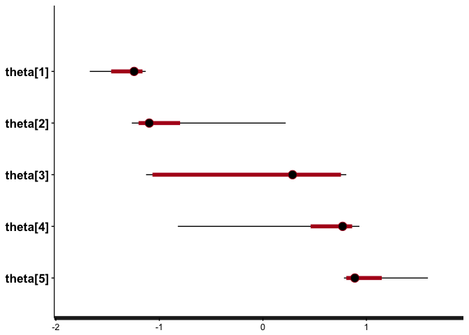
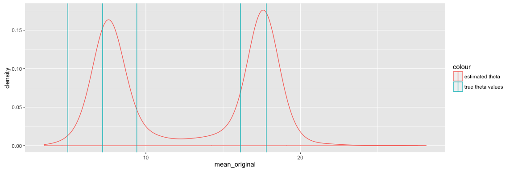

Purpose
-------

We're going to try out a few simple models using Dirichlet-process
priors, to see how they work in Stan.

Generating some fake data
-------------------------

Here we're going to simulate some data according to the \[Chinese
Resaurant Process\]. This is described in this [blog
post](http://blog.datumbox.com/the-dirichlet-process-the-chinese-restaurant-process-and-other-representations/)
by [Vasilis Vryniotis](http://blog.datumbox.com/author/bbriniotis/).

    ## function to add a customer to a table
    add_customer <- function(thetas, alpha, base_function) {
      
      if (!exists('restaurant')) {
        ## start with an empty restaurant
        restaurant <<- data.frame(cust_id = integer(),
                             table_id = integer(),
                             theta = numeric(),
                             #value = numeric(),
                             NULL
                             )
        ## first customer sits at first table 
        cust <- 1
        table <- 1
        theta <- base_function()
      } else {
        # subsequent customers sometimes sit at new tables, sometimes join existing tables 
        num_prev_cust <- nrow(restaurant)
        num_curr_tables <- max(restaurant$table_id)
        cust <- num_prev_cust + 1
        prob_sit_new_table <- alpha / (num_prev_cust + alpha)
        sit_new_table <- rbinom(1,1,prob_sit_new_table)
        
        if (sit_new_table == 1) {
          table <- num_curr_tables + 1
          theta <- base_function()
        }
        else {
          table_counts <- restaurant %>% 
            group_by(table_id) %>%
            summarize(prob = n()/(num_prev_cust + alpha)
                      , theta = unique(theta)
                      ) %>%
            ungroup()
          selected_table <- table_counts %>% dplyr::filter(rmultinom(1, 1, table_counts$prob) == 1)
          table <- selected_table$table_id
          theta <- selected_table$theta
        }
      }  
        
      restaurant <<- restaurant %>%
        dplyr::bind_rows(list(cust_id = cust, table_id = table, theta = theta))
      return(TRUE)
    }

    # dispersion / parameter (alpha) - larger the value, more frequently new tables are spawned
    a <- 1

    ## Base function used to generate new values of theta
    g_base <- purrr::partial(rnorm, n = 1, mean = 10, sd = 5)

    rm(restaurant)
    for (i in 1:100) {
      add_customer(thetas = thetas, alpha = a, base_function = g_base)
    }

    ## summarize
    restaurant %>% 
      group_by(table_id) %>%
      summarize(n = n(),
                theta = unique(theta)
                )

    ## Source: local data frame [5 x 3]
    ## 
    ##   table_id     n     theta
    ##      (dbl) (int)     (dbl)
    ## 1        1    48  6.510060
    ## 2        2    41 14.949795
    ## 3        3     6 10.538637
    ## 4        4     4 15.424819
    ## 5        5     1  9.688212

Next we add noise to our model, to simulate a more realistic
data-generating process

    noise_generator <- purrr::partial(rnorm, n = 1, mean = 0, sd = 1)

    restaurant <- restaurant %>%
      rowwise() %>%
      mutate(value = theta + noise_generator()) %>%
      ungroup()

    ggplot(restaurant, aes(x = value, group = table_id, colour = factor(table_id))) + geom_density()

<!-- -->

Rescaling data
--------------

Now, let's simulate the data analysis process which will be ignorant of
true cluster IDs.

First, we would rescale values according to observed mean & sd.

    restaurant <- restaurant %>%
      mutate(global_mean = mean(value),
             global_sd = sd(value),
             rescaled_value = (value - global_mean)/global_sd
             )

    ggplot(restaurant, aes(x = rescaled_value, group = table_id, colour = factor(table_id))) + geom_density()

<!-- -->

Defining the model
------------------

This is a first pass at fitting this model using Stan, as if it were a
simple mixture model.

    model_string <- "
    data {
      int n;
      real y[n];
      int K; ## presumed number of groups
    }

    parameters {
      simplex[K] proportions;
      ordered[K] theta; ## means for each group
      real<lower=0> sigma; ## overall sigma; does not vary by group
    }

    model {
      real ps[K]; ## temp holder for log component densities
      
      ## prior on thetas; normally distributed with mean 0 and sd 1
      theta ~ normal(0, 1);
      
      ## for now, no prior on proportions. Should prob be a dirichlet prior
      for (i in 1:n) {
        for (k in 1:K) {
          ps[k] <- log(proportions[k]) + normal_log(y[i], theta[k], sigma);
        }
        increment_log_prob(log_sum_exp(ps));
      }
    }

    "

Note that we've skipped the "generated quantities" block for now; means
we won't be able to do PP checks or run loo. We'll add it back in once
we have a model that works well.

Fitting the model in Stan
-------------------------

    iter <- 500
    stan_samples <- stan(model_code = model_string,
                         iter = iter,
                         data = list(y = restaurant$rescaled_value,
                                     n = nrow(restaurant),
                                     K = 5),
                         model_name = 'Simple mixture model with K = 5'
                         )

    ## 
    ## SAMPLING FOR MODEL 'Simple mixture model with K = 5' NOW (CHAIN 1).
    ## 
    ## Chain 1, Iteration:   1 / 500 [  0%]  (Warmup)
    ## Chain 1, Iteration:  50 / 500 [ 10%]  (Warmup)
    ## Chain 1, Iteration: 100 / 500 [ 20%]  (Warmup)
    ## Chain 1, Iteration: 150 / 500 [ 30%]  (Warmup)
    ## Chain 1, Iteration: 200 / 500 [ 40%]  (Warmup)
    ## Chain 1, Iteration: 250 / 500 [ 50%]  (Warmup)
    ## Chain 1, Iteration: 251 / 500 [ 50%]  (Sampling)
    ## Chain 1, Iteration: 300 / 500 [ 60%]  (Sampling)
    ## Chain 1, Iteration: 350 / 500 [ 70%]  (Sampling)
    ## Chain 1, Iteration: 400 / 500 [ 80%]  (Sampling)
    ## Chain 1, Iteration: 450 / 500 [ 90%]  (Sampling)
    ## Chain 1, Iteration: 500 / 500 [100%]  (Sampling)# 
    ## #  Elapsed Time: 1.67309 seconds (Warm-up)
    ## #                1.48943 seconds (Sampling)
    ## #                3.16252 seconds (Total)
    ## # 
    ## 
    ## SAMPLING FOR MODEL 'Simple mixture model with K = 5' NOW (CHAIN 2).
    ## 
    ## Chain 2, Iteration:   1 / 500 [  0%]  (Warmup)
    ## Chain 2, Iteration:  50 / 500 [ 10%]  (Warmup)
    ## Chain 2, Iteration: 100 / 500 [ 20%]  (Warmup)
    ## Chain 2, Iteration: 150 / 500 [ 30%]  (Warmup)
    ## Chain 2, Iteration: 200 / 500 [ 40%]  (Warmup)
    ## Chain 2, Iteration: 250 / 500 [ 50%]  (Warmup)
    ## Chain 2, Iteration: 251 / 500 [ 50%]  (Sampling)
    ## Chain 2, Iteration: 300 / 500 [ 60%]  (Sampling)
    ## Chain 2, Iteration: 350 / 500 [ 70%]  (Sampling)
    ## Chain 2, Iteration: 400 / 500 [ 80%]  (Sampling)
    ## Chain 2, Iteration: 450 / 500 [ 90%]  (Sampling)
    ## Chain 2, Iteration: 500 / 500 [100%]  (Sampling)# 
    ## #  Elapsed Time: 1.12958 seconds (Warm-up)
    ## #                2.002 seconds (Sampling)
    ## #                3.13157 seconds (Total)
    ## # 
    ## 
    ## SAMPLING FOR MODEL 'Simple mixture model with K = 5' NOW (CHAIN 3).
    ## 
    ## Chain 3, Iteration:   1 / 500 [  0%]  (Warmup)
    ## Chain 3, Iteration:  50 / 500 [ 10%]  (Warmup)
    ## Chain 3, Iteration: 100 / 500 [ 20%]  (Warmup)
    ## Chain 3, Iteration: 150 / 500 [ 30%]  (Warmup)
    ## Chain 3, Iteration: 200 / 500 [ 40%]  (Warmup)
    ## Chain 3, Iteration: 250 / 500 [ 50%]  (Warmup)
    ## Chain 3, Iteration: 251 / 500 [ 50%]  (Sampling)
    ## Chain 3, Iteration: 300 / 500 [ 60%]  (Sampling)
    ## Chain 3, Iteration: 350 / 500 [ 70%]  (Sampling)
    ## Chain 3, Iteration: 400 / 500 [ 80%]  (Sampling)
    ## Chain 3, Iteration: 450 / 500 [ 90%]  (Sampling)
    ## Chain 3, Iteration: 500 / 500 [100%]  (Sampling)# 
    ## #  Elapsed Time: 2.1904 seconds (Warm-up)
    ## #                1.86333 seconds (Sampling)
    ## #                4.05373 seconds (Total)
    ## # 
    ## 
    ## SAMPLING FOR MODEL 'Simple mixture model with K = 5' NOW (CHAIN 4).
    ## 
    ## Chain 4, Iteration:   1 / 500 [  0%]  (Warmup)
    ## Chain 4, Iteration:  50 / 500 [ 10%]  (Warmup)
    ## Chain 4, Iteration: 100 / 500 [ 20%]  (Warmup)
    ## Chain 4, Iteration: 150 / 500 [ 30%]  (Warmup)
    ## Chain 4, Iteration: 200 / 500 [ 40%]  (Warmup)
    ## Chain 4, Iteration: 250 / 500 [ 50%]  (Warmup)
    ## Chain 4, Iteration: 251 / 500 [ 50%]  (Sampling)
    ## Chain 4, Iteration: 300 / 500 [ 60%]  (Sampling)
    ## Chain 4, Iteration: 350 / 500 [ 70%]  (Sampling)
    ## Chain 4, Iteration: 400 / 500 [ 80%]  (Sampling)
    ## Chain 4, Iteration: 450 / 500 [ 90%]  (Sampling)
    ## Chain 4, Iteration: 500 / 500 [100%]  (Sampling)# 
    ## #  Elapsed Time: 1.86966 seconds (Warm-up)
    ## #                1.70403 seconds (Sampling)
    ## #                3.57369 seconds (Total)
    ## #

    # summarize outcome of interest
    print(stan_samples, pars = 'theta')

    ## Inference for Stan model: Simple mixture model with K = 5.
    ## 4 chains, each with iter=500; warmup=250; thin=1; 
    ## post-warmup draws per chain=250, total post-warmup draws=1000.
    ## 
    ##           mean se_mean   sd  2.5%   25%   50%   75% 97.5% n_eff Rhat
    ## theta[1] -1.15    0.02 0.23 -1.76 -1.21 -1.09 -1.01 -0.93   116 1.04
    ## theta[2] -0.79    0.04 0.29 -1.13 -0.96 -0.88 -0.74  0.02    67 1.07
    ## theta[3] -0.29    0.06 0.43 -0.93 -0.73 -0.19  0.02  0.64    53 1.10
    ## theta[4]  0.39    0.09 0.45 -0.18  0.03  0.20  0.93  1.07    25 1.17
    ## theta[5]  1.07    0.01 0.09  0.98  1.03  1.06  1.10  1.29   150 1.04
    ## 
    ## Samples were drawn using NUTS(diag_e) at Mon May  2 16:45:21 2016.
    ## For each parameter, n_eff is a crude measure of effective sample size,
    ## and Rhat is the potential scale reduction factor on split chains (at 
    ## convergence, Rhat=1).

### Evaluating model fit

Review traceplot for theta - main parameter of interest

    traceplot(stan_samples, pars = 'theta')

<!-- -->

### Review 50 & 95% posterior density for theta

    plot(stan_samples, pars = 'theta')

<!-- -->

### Comparing estimated theta to true values

Next, since we are dealing with simulated data, we can compare the
values of our estimated parameter (*theta*) to the true value used to
generate the samples.

It's unlikely that the true value would be well outside our posterior
distribution for theta, but it's possible.

First we do some data-prep to collect & transform the values of theta
toput them on the original scale.

    ## true values, on original scale
    true_thetas <- unique(restaurant$theta)
    true_thetas <- true_thetas[order(true_thetas)]

    ## save, so we can transform thetahat to original scale
    global_mean <- unique(restaurant$global_mean)
    global_sd <- unique(restaurant$global_sd)

    # matrix of estimated values, on modified (rescaled) scale
    thetahat <- unlist(rstan::extract(stan_samples, 'theta')$theta)

    # modify into a dataset
    #rownames(thetahat) <- seq(from = 1, to = nrow(thetahat), by = 1)
    colnames(thetahat) <- seq(from = 1, to = 5, by = 1)
    thdata <- as.data.frame(thetahat) %>%
      mutate(iter = n()) %>%
      tidyr::gather(sample, mean_rescaled, 1:5, convert = T) %>%
      mutate(mean_original = (mean_rescaled * global_sd) + global_mean)

Next, we plot the observed & true means on the recentered scale

    library(ggplot2)
    ggplot() +
      geom_density(aes(x = mean_rescaled, group = sample, colour = 'estimated theta'), data = thdata) +
      geom_vline(aes(xintercept = mean, colour = 'true theta values'), data = restaurant %>% group_by(table_id) %>% summarize(mean = mean(rescaled_value, na.rm = T)) %>% ungroup())

<!-- -->

And, the observed vs true estimates of theta

    library(ggplot2)
    ggplot() +
      geom_density(aes(x = mean_original, group = sample, colour = 'estimated theta'), data = thdata) +
      geom_vline(aes(xintercept = true_thetas, colour = 'true theta values'))

<!-- -->

We notice that even though we have constrained the values of theta to be
ordered, there are still some label-switching problems.

IE each 'sample' has a multi-modal distribution of theta. Collapsing
these may yield a more complete picture.

    library(ggplot2)
    ggplot() +
      geom_density(aes(x = mean_original, colour = 'estimated theta'), data = thdata) +
      geom_vline(aes(xintercept = true_thetas, colour = 'true theta values'))

<!-- -->

Notice how the smoothed estimates look more consistent with a 3-cluster
result (ie K = 3), rather than the true value (K = 5).

Let's see if Loo can help us distinguish between different values of K.

Using Loo to find optimal values of K
-------------------------------------

[Loo](http://www.stat.columbia.edu/~gelman/research/unpublished/loo_stan.pdf)
approximates leave-one-out validation, and can be used to identify
observations with undue influence (leverage) on the model and/or for
model comparison.

In this case, we will use Loo for sanity checking & to compare model fit
under different values of K.

### Writing the generated quantities block

In order to use Loo, we need to first calculate the log\_liklihood in
the generated quantities block.

Our revised model string will look like this:

    model_string_with_loglik <- "
    data {
      int n;
      real y[n];
      int K; ## presumed number of groups
    }

    parameters {
      simplex[K] proportions;
      ordered[K] theta; ## means for each group
      real<lower=0> sigma; ## overall sigma; does not vary by group
    }

    model {
      ## prior on thetas; normally distributed with mean 0 and sd 1
      theta ~ normal(0, 1);
      
      ## for now, no prior on proportions. Should prob be a dirichlet prior
      for (i in 1:n) {
        real ps[K]; ## temp holder for log component densities
        for (k in 1:K) {
          ps[k] <- log(proportions[k]) + normal_log(y[i], theta[k], sigma);
        }
        increment_log_prob(log_sum_exp(ps));
      }
    }

    generated quantities {
      real log_lik[n];
      
      for (i in 1:n) {
        real ps[K]; ## temp holder for log component densities
        for (k in 1:K) {
          ps[k] <- log(proportions[k]) + normal_log(y[i], theta[k], sigma);
        }
        log_lik[i] <- log_sum_exp(ps);
      }
    }
    "

Let's do a quick sanity check to see if the model works as it did
before.

    stan_samples_k5 <- stan(model_code = model_string_with_loglik,
                         iter = iter,
                         data = list(y = restaurant$rescaled_value,
                                     n = nrow(restaurant),
                                     K = 5),
                         model_name = 'Simple mixture model with K = 5 (v2)'
                         )

    ## 
    ## SAMPLING FOR MODEL 'Simple mixture model with K = 5 (v2)' NOW (CHAIN 1).
    ## 
    ## Chain 1, Iteration:   1 / 500 [  0%]  (Warmup)
    ## Chain 1, Iteration:  50 / 500 [ 10%]  (Warmup)
    ## Chain 1, Iteration: 100 / 500 [ 20%]  (Warmup)
    ## Chain 1, Iteration: 150 / 500 [ 30%]  (Warmup)
    ## Chain 1, Iteration: 200 / 500 [ 40%]  (Warmup)
    ## Chain 1, Iteration: 250 / 500 [ 50%]  (Warmup)
    ## Chain 1, Iteration: 251 / 500 [ 50%]  (Sampling)
    ## Chain 1, Iteration: 300 / 500 [ 60%]  (Sampling)
    ## Chain 1, Iteration: 350 / 500 [ 70%]  (Sampling)
    ## Chain 1, Iteration: 400 / 500 [ 80%]  (Sampling)
    ## Chain 1, Iteration: 450 / 500 [ 90%]  (Sampling)
    ## Chain 1, Iteration: 500 / 500 [100%]  (Sampling)# 
    ## #  Elapsed Time: 1.74008 seconds (Warm-up)
    ## #                2.15819 seconds (Sampling)
    ## #                3.89827 seconds (Total)
    ## # 
    ## 
    ## SAMPLING FOR MODEL 'Simple mixture model with K = 5 (v2)' NOW (CHAIN 2).
    ## 
    ## Chain 2, Iteration:   1 / 500 [  0%]  (Warmup)
    ## Chain 2, Iteration:  50 / 500 [ 10%]  (Warmup)
    ## Chain 2, Iteration: 100 / 500 [ 20%]  (Warmup)
    ## Chain 2, Iteration: 150 / 500 [ 30%]  (Warmup)
    ## Chain 2, Iteration: 200 / 500 [ 40%]  (Warmup)
    ## Chain 2, Iteration: 250 / 500 [ 50%]  (Warmup)
    ## Chain 2, Iteration: 251 / 500 [ 50%]  (Sampling)
    ## Chain 2, Iteration: 300 / 500 [ 60%]  (Sampling)
    ## Chain 2, Iteration: 350 / 500 [ 70%]  (Sampling)
    ## Chain 2, Iteration: 400 / 500 [ 80%]  (Sampling)
    ## Chain 2, Iteration: 450 / 500 [ 90%]  (Sampling)
    ## Chain 2, Iteration: 500 / 500 [100%]  (Sampling)# 
    ## #  Elapsed Time: 1.8243 seconds (Warm-up)
    ## #                1.70557 seconds (Sampling)
    ## #                3.52987 seconds (Total)
    ## # 
    ## 
    ## SAMPLING FOR MODEL 'Simple mixture model with K = 5 (v2)' NOW (CHAIN 3).
    ## 
    ## Chain 3, Iteration:   1 / 500 [  0%]  (Warmup)
    ## Chain 3, Iteration:  50 / 500 [ 10%]  (Warmup)
    ## Chain 3, Iteration: 100 / 500 [ 20%]  (Warmup)
    ## Chain 3, Iteration: 150 / 500 [ 30%]  (Warmup)
    ## Chain 3, Iteration: 200 / 500 [ 40%]  (Warmup)
    ## Chain 3, Iteration: 250 / 500 [ 50%]  (Warmup)
    ## Chain 3, Iteration: 251 / 500 [ 50%]  (Sampling)
    ## Chain 3, Iteration: 300 / 500 [ 60%]  (Sampling)
    ## Chain 3, Iteration: 350 / 500 [ 70%]  (Sampling)
    ## Chain 3, Iteration: 400 / 500 [ 80%]  (Sampling)
    ## Chain 3, Iteration: 450 / 500 [ 90%]  (Sampling)
    ## Chain 3, Iteration: 500 / 500 [100%]  (Sampling)# 
    ## #  Elapsed Time: 2.10957 seconds (Warm-up)
    ## #                2.5324 seconds (Sampling)
    ## #                4.64198 seconds (Total)
    ## # 
    ## 
    ## SAMPLING FOR MODEL 'Simple mixture model with K = 5 (v2)' NOW (CHAIN 4).
    ## 
    ## Chain 4, Iteration:   1 / 500 [  0%]  (Warmup)
    ## Chain 4, Iteration:  50 / 500 [ 10%]  (Warmup)
    ## Chain 4, Iteration: 100 / 500 [ 20%]  (Warmup)
    ## Chain 4, Iteration: 150 / 500 [ 30%]  (Warmup)
    ## Chain 4, Iteration: 200 / 500 [ 40%]  (Warmup)
    ## Chain 4, Iteration: 250 / 500 [ 50%]  (Warmup)
    ## Chain 4, Iteration: 251 / 500 [ 50%]  (Sampling)
    ## Chain 4, Iteration: 300 / 500 [ 60%]  (Sampling)
    ## Chain 4, Iteration: 350 / 500 [ 70%]  (Sampling)
    ## Chain 4, Iteration: 400 / 500 [ 80%]  (Sampling)
    ## Chain 4, Iteration: 450 / 500 [ 90%]  (Sampling)
    ## Chain 4, Iteration: 500 / 500 [100%]  (Sampling)# 
    ## #  Elapsed Time: 2.04358 seconds (Warm-up)
    ## #                2.19862 seconds (Sampling)
    ## #                4.2422 seconds (Total)
    ## #

    # summarize outcome of interest
    print(stan_samples_k5, pars = 'theta')

    ## Inference for Stan model: Simple mixture model with K = 5 (v2).
    ## 4 chains, each with iter=500; warmup=250; thin=1; 
    ## post-warmup draws per chain=250, total post-warmup draws=1000.
    ## 
    ##           mean se_mean   sd  2.5%   25%   50%   75% 97.5% n_eff Rhat
    ## theta[1] -1.15    0.02 0.22 -1.88 -1.22 -1.09 -1.01 -0.93   144 1.02
    ## theta[2] -0.81    0.02 0.24 -1.10 -0.94 -0.88 -0.78 -0.05   121 1.03
    ## theta[3] -0.12    0.05 0.34 -0.91 -0.19 -0.04  0.06  0.38    56 1.05
    ## theta[4]  0.62    0.06 0.44 -0.11  0.13  0.87  1.00  1.09    52 1.06
    ## theta[5]  1.11    0.01 0.14  0.98  1.04  1.07  1.13  1.37   308 1.01
    ## 
    ## Samples were drawn using NUTS(diag_e) at Mon May  2 16:45:40 2016.
    ## For each parameter, n_eff is a crude measure of effective sample size,
    ## and Rhat is the potential scale reduction factor on split chains (at 
    ## convergence, Rhat=1).

### Loo with k = 5

    loo_k5 <- loo(rstan::extract(stan_samples_k5, 'log_lik')$log_lik)

### Estimating model with k = 3,4 and 5

(note: output is hidden for sake of brevity)

    ## K = 2
    stan_samples_k2 <- stan(model_code = model_string_with_loglik,
                         iter = iter,
                         data = list(y = restaurant$rescaled_value,
                                     n = nrow(restaurant),
                                     K = 2),
                         model_name = 'Simple mixture model with K = 2 (v2)'
                         )

    print(stan_samples_k2, pars = 'theta')
    loo_k2 <- loo(rstan::extract(stan_samples_k2, 'log_lik')$log_lik)

    ## K = 3
    stan_samples_k3 <- stan(model_code = model_string_with_loglik,
                         iter = iter,
                         data = list(y = restaurant$rescaled_value,
                                     n = nrow(restaurant),
                                     K = 3),
                         model_name = 'Simple mixture model with K = 3 (v2)'
                         )

    print(stan_samples_k3, pars = 'theta')
    loo_k3 <- loo(rstan::extract(stan_samples_k3, 'log_lik')$log_lik)

    ## K = 4
    stan_samples_k4 <- stan(model_code = model_string_with_loglik,
                         iter = iter,
                         data = list(y = restaurant$rescaled_value,
                                     n = nrow(restaurant),
                                     K = 4),
                         model_name = 'Simple mixture model with K = 4 (v2)'
                         )

    # summarize outcome of interest
    print(stan_samples_k4, pars = 'theta')
    loo_k4 <- loo(rstan::extract(stan_samples_k4, 'log_lik')$log_lik)

### Comparing model fit using Loo

Note that higher values of elpd\_loo are better -- so the first model
(loo\_k4) listed here is likely the "best"" fit.

    loo::compare(loo_k2, loo_k3, loo_k4, loo_k5)

    ##        looic  se_looic elpd_loo se_elpd_loo p_loo  se_p_loo
    ## loo_k3  193.2   16.2    -96.6      8.1         6.0    0.9  
    ## loo_k4  193.6   16.0    -96.8      8.0         6.5    1.1  
    ## loo_k5  193.8   15.8    -96.9      7.9         6.7    1.1  
    ## loo_k2  208.4   15.3   -104.2      7.6         4.3    0.6

The relative differences between the models with k = 3, 4, and 5 are
fairly small, however.

The biggest gain is seen between models with K = 2 vs K = 3:

    loo::compare(loo_k2, loo_k3)

    ## elpd_diff        se 
    ##       7.6       4.1

Looking at K = 3 vs K = 4, however, the difference is minimal:

    loo::compare(loo_k3, loo_k4)

    ## elpd_diff        se 
    ##      -0.2       0.3

And, actually worsens for K = 4 vs K = 5

    loo::compare(loo_k4, loo_k5)

    ## elpd_diff        se 
    ##      -0.1       0.2

Based on these results, the best fits have K = 3 or K = 4. Ideal result
will likely be an average of the two models.

Improving the model using Dirichlet prior
-----------------------------------------

Now that we have a reasonably-well-fitting mixture model, let's see how
this can be improved by incorporating a Dirichlet prior.

Since our data were generated according to a dirichlet process (at least
we think they were!), it's plausible that this prior may yield a
distribution of group sizes that better match our data.

    model_string_with_dp <- "
    data {
      int n;
      real y[n];
      int K; ## presumed number of groups
    }

    parameters {
      simplex[K] proportions;
      ordered[K] theta; ## means for each group
      real<lower=0> sigma; ## overall sigma; does not vary by group
      vector<lower=0>[K] alpha;
    }

    model {
      ## prior on thetas; normally distributed with mean 0 and sd 1
      theta ~ normal(0, 1);
      proportions ~ dirichlet(alpha);
      
      ## for now, no prior on proportions. Should prob be a dirichlet prior
      for (i in 1:n) {
        real ps[K]; ## temp holder for log component densities
        for (k in 1:K) {
          ps[k] <- log(proportions[k]) + normal_log(y[i], theta[k], sigma);
        }
        increment_log_prob(log_sum_exp(ps));
      }
    }

    generated quantities {
      real log_lik[n];
      
      for (i in 1:n) {
        real ps[K]; ## temp holder for log component densities
        for (k in 1:K) {
          ps[k] <- log(proportions[k]) + normal_log(y[i], theta[k], sigma);
        }
        log_lik[i] <- log_sum_exp(ps);
      }
    }
    "

### Fitting Dirichlet-prior model to data

Try fitting this revised model to our data. For now, start with K = 5
since that's the "ground truth"

    stan_samples_dp <- stan(model_code = model_string_with_dp,
                         iter = iter,
                         data = list(y = restaurant$rescaled_value,
                                     n = nrow(restaurant),
                                     K = 5),
                         model_name = 'Simple mixture model with Dirichlet prior (K = 5)'
                         )

    print(stan_samples_dp, pars = 'theta')

    ## Note: increasing adapt_delta to see if this helps
    stan_samples_dp2 <- stan(model_code = model_string_with_dp,
                         iter = iter,
                         data = list(y = restaurant$rescaled_value,
                                     n = nrow(restaurant),
                                     K = 5),
                         model_name = 'Simple mixture model with Dirichlet prior (K = 5)',
                         control = list(adapt_delta = 0.9)
                         )

    # summarize outcome of interest
    print(stan_samples_dp2, pars = 'theta')

    # Note: increasing max_treedepth to see if this helps 
    stan_samples_dp3 <- stan(model_code = model_string_with_dp,
                         iter = iter,
                         data = list(y = restaurant$rescaled_value,
                                     n = nrow(restaurant),
                                     K = 5),
                         model_name = 'Simple mixture model with Dirichlet prior (K = 5)',
                         control = list(adapt_delta = 0.9, max_treedepth = 15)
                         )

    # summarize outcome of interest
    print(stan_samples_dp3, pars = 'theta')

Before we go any further, it appears our Rhat values are pretty crappy
(ie not close to 1). Let's increase the number of iterations to see how
this improves the model fit.

### compare dp-derived model to the simple mixture model

    loo_dp <- loo(rstan::extract(stan_samples_dp3,'log_lik')$log_lik)
    loo::compare(loo_dp, loo_k5)
