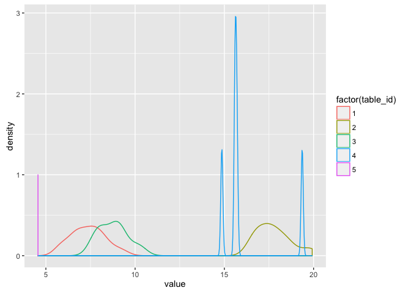
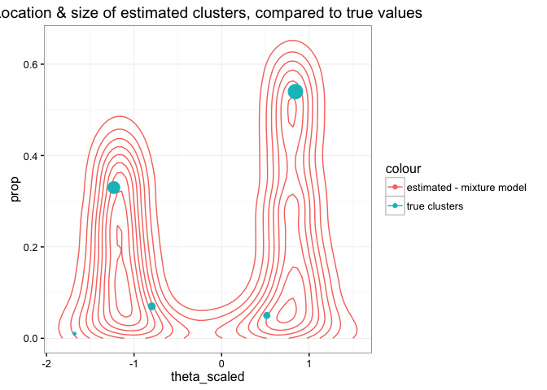
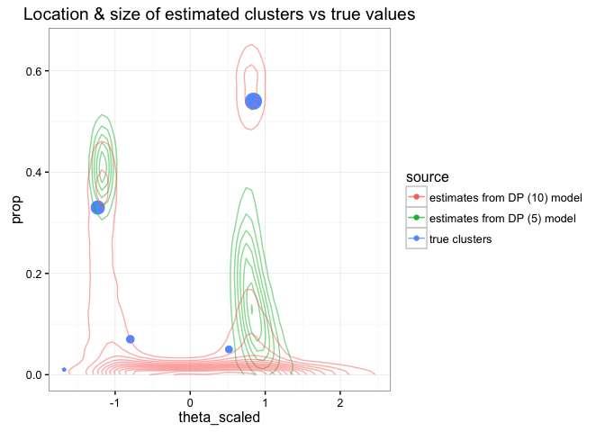
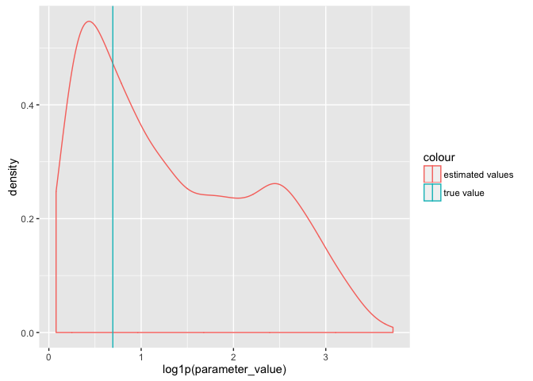
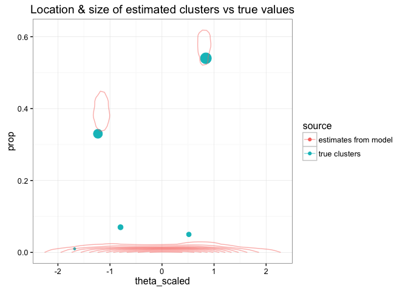

-   [Purpose](#purpose)
-   [Generating some fake data](#generating-some-fake-data)
-   [Rescaling data](#rescaling-data)
-   [Defining the mixture model](#defining-the-mixture-model)
-   [Fitting the model in Stan](#fitting-the-model-in-stan)
-   [Using Loo to find optimal values of K](#using-loo-to-find-optimal-values-of-k)
-   [Improving the model using Dirichlet prior](#improving-the-model-using-dirichlet-prior)
-   [Improving the model by unconstraining theta](#improving-the-model-by-unconstraining-theta)
-   [Improving the model by adjusting priors on a and theta](#improving-the-model-by-adjusting-priors-on-a-and-theta)
-   [Summarizing what we've learned](#summarizing-what-weve-learned)

Purpose
-------

We're going to try out a few simple models using Dirichlet-process priors, to see how they work in Stan.

Note that the first version of this document used a particular / fixed seed to compare methods for a particular set of simulated data. This revised version is going to compare the methods for a number of iterations, since the best method *on average* may not be the same as the best method for a particular set of data.

Generating some fake data
-------------------------

Here we're going to simulate some data according to the [Chinese Resaurant Process](https://en.wikipedia.org/wiki/Chinese_restaurant_process). This is described in this [blog post](http://blog.datumbox.com/the-dirichlet-process-the-chinese-restaurant-process-and-other-representations/) by [Vasilis Vryniotis](http://blog.datumbox.com/author/bbriniotis/).

``` r
## function to add a customer to a table
add_customer <- function(alpha, base_function, d = NULL) {
  
  if (is.null(d)) {
    ## start with an empty restaurant
    d <- data.frame(cust_id = integer(),
                         table_id = integer(),
                         theta = numeric(),
                         #value = numeric(),
                         NULL
                         )
    ## first customer sits at first table 
    cust <- 1
    table <- 1
    theta <- base_function()
    
  } else {
    # subsequent customers sometimes sit at new tables, sometimes join existing tables 
    num_prev_cust <- nrow(d)
    num_curr_tables <- max(d$table_id)
    cust <- num_prev_cust + 1
    prob_sit_new_table <- alpha / (num_prev_cust + alpha)
    sit_new_table <- rbinom(1, 1, prob_sit_new_table)
    
    if (sit_new_table == 1) {
      ## add new table
      table <- num_curr_tables + 1
      theta <- base_function()
    }
    else {
      ## pick from existing tables
      table_counts <- d %>% 
        group_by(table_id) %>%
        summarize(prob = unique(n()/(num_prev_cust + alpha))
                  , theta = unique(theta)
                  ) %>%
        ungroup()
      selected_table <- 
        table_counts %>% 
        dplyr::filter(rmultinom(1, 1, table_counts$prob) == 1)
      table <- selected_table$table_id
      theta <- selected_table$theta
    }
  }  
  ## add customer to dataset
  d <- d %>%
    dplyr::bind_rows(list(cust_id = cust, table_id = table, theta = theta))
  return(d)
}

## code to generate data - wrap in a function so we can use this later.
simulate_data <- 
  function(a = 1
           , g_base = purrr::partial(rnorm, n = 1, mean = 10, sd = 5)
           , n = 100
  ) {
    d <- NULL
    for (i in seq(from = 1, to = n, by = 1)) {
      d <- 
        add_customer(alpha = a
                     , base_function = g_base
                     , d = d
                     )
    }
    return(d)
  }
```

Now that we've defined the function to simulate the data, let's generate our first dataset.

We will use this to build & test the various models, then repeat the process with a variety of seeds to see which method is best on average.

``` r
set.seed(123)
restaurant <- simulate_data()

## summarize
restaurant %>% 
  group_by(table_id) %>%
  summarize(n = n(),
            theta = unique(theta)
            )
```

    ## Source: local data frame [5 x 3]
    ## 
    ##   table_id     n     theta
    ##      (dbl) (int)     (dbl)
    ## 1        1    33  7.197622
    ## 2        2    54 17.793542
    ## 3        3     7  9.413790
    ## 4        4     5 16.120409
    ## 5        5     1  4.907123

Next we add noise to our model, to simulate a more realistic data-generating process

``` r
noise_generator <- purrr::partial(rnorm, n = 1, mean = 0, sd = 1)

restaurant <- restaurant %>%
  rowwise() %>%
  mutate(value = theta + noise_generator()) %>%
  ungroup()

ggplot(restaurant, aes(x = value, group = table_id, colour = factor(table_id))) + geom_density()
```

<!-- -->

Rescaling data
--------------

Now, let's simulate the data analysis process which will be ignorant of true cluster IDs.

First, we would rescale values according to observed mean & sd.

``` r
restaurant <- restaurant %>%
  mutate(global_mean = mean(value)
         , global_sd = sd(value)
         , rescaled_value = (value - global_mean)/global_sd
         , theta_scaled = (theta - global_mean)/global_sd
         )

ggplot(restaurant
       , aes(x = rescaled_value
             , group = table_id
             , fill = factor(table_id)
             , colour = factor(table_id))
       ) + 
  geom_histogram(position = 'dodge') +
  theme_bw() +
  ggtitle('Sampled values by table (cluster) id, after rescaling')
```

<!-- -->

### Writing prep-data function

Let's wrap these last two steps as functions & append them to our simulate\_data function. We'll call the final function **prep\_restaurant\_data**.

``` r
## first define the function to add noise to the model
add_noise <- 
  function(d
           , noise_generator = purrr::partial(rnorm, n = 1, mean = 0, sd = 1)
           , ...
  ) {
    d <- d %>%
      rowwise() %>%
      mutate(value = theta + noise_generator()) %>%
      ungroup()
    return(d)
  }

## next define a function to rescale the estimated values 
rescale_values <- 
  function(d
           , ...
  ) {
    d <- d %>%
      mutate(global_mean = mean(value)
             , global_sd = sd(value)
             , rescaled_value = (value - global_mean)/global_sd
             , theta_scaled = (theta - global_mean)/global_sd
      )
    return(d)
  }

prep_restaurant_data <- purrr::compose(rescale_values, add_noise, simulate_data)

## test the process
testthat::test_that(
  'prep_restaurant_data returns dataset'
  , {
    test_rest <- prep_restaurant_data()
    testthat::expect_is(test_rest, 'data.frame')
  })

testthat::test_that(
  'running prep_restaurant_data twice yields different datasets'
  , {
    test_rest <- prep_restaurant_data()
    test_rest2 <- prep_restaurant_data()
    testthat::expect_false(isTRUE(all.equal(test_rest, test_rest2)))
  }
)

testthat::test_that(
  'prep_restaurant_data returns correct number of rows'
  , {
    test_rest <- prep_restaurant_data(n = 100)
    testthat::expect_equal(nrow(test_rest), 100)
    test_rest2 <- prep_restaurant_data(n = 500)
    testthat::expect_equal(nrow(test_rest2), 500)
  }
)
```

We will come back to this function later in our code. For now, we will use the simulated data to define the models we want to use to segment these data.

Defining the mixture model
--------------------------

As a first pass at fitting this model using Stan, we will define a simple Gaussian mixture model.

``` r
model_string <- "
data {
  int n;
  real y[n];
  int K; ## presumed number of groups
}

parameters {
  simplex[K] proportions;
  ordered[K] theta; ## means for each group
  real<lower=0> sigma; ## overall sigma; does not vary by group
}

model {
  real ps[K]; ## temp holder for log component densities
  
  ## prior on thetas; normally distributed with mean 0 and sd 1
  theta ~ normal(0, 1);
  
  ## for now, no prior on proportions. Should prob be a dirichlet prior
  for (i in 1:n) {
    for (k in 1:K) {
      ps[k] <- log(proportions[k]) + normal_log(y[i], theta[k], sigma);
    }
    increment_log_prob(log_sum_exp(ps));
  }
}

"
```

Note that we've skipped the "generated quantities" block for now; this means we won't be able to do PP checks or run loo.

We'll add it back in once we see how well this model works.

Fitting the model in Stan
-------------------------

``` r
iter <- 500
seed <- 1235 ## seed value passed to Stan
stan_samples <- stan(model_code = model_string,
                     iter = iter,
                     seed = seed,
                     data = list(y = restaurant$rescaled_value,
                                 n = nrow(restaurant),
                                 K = 5),
                     model_name = 'Gaussian mixture model'
                     )

# summarize outcome of interest
print(stan_samples, pars = 'theta')
```

    ## Inference for Stan model: Gaussian mixture model.
    ## 4 chains, each with iter=500; warmup=250; thin=1; 
    ## post-warmup draws per chain=250, total post-warmup draws=1000.
    ## 
    ##           mean se_mean   sd  2.5%   25%   50%   75% 97.5% n_eff Rhat
    ## theta[1] -1.28    0.01 0.14 -1.67 -1.33 -1.24 -1.19 -1.13   148 1.02
    ## theta[2] -1.01    0.03 0.33 -1.27 -1.16 -1.10 -1.02  0.22   142 1.02
    ## theta[3] -0.05    0.12 0.75 -1.13 -0.89  0.28  0.66  0.81    40 1.09
    ## theta[4]  0.67    0.03 0.37 -0.82  0.70  0.77  0.82  0.93   131 1.03
    ## theta[5]  0.95    0.01 0.22  0.78  0.83  0.89  1.00  1.59   400 1.01
    ## 
    ## Samples were drawn using NUTS(diag_e) at Thu May  5 12:36:03 2016.
    ## For each parameter, n_eff is a crude measure of effective sample size,
    ## and Rhat is the potential scale reduction factor on split chains (at 
    ## convergence, Rhat=1).

### Evaluating model fit

Review traceplot for theta - main parameter of interest

``` r
traceplot(stan_samples, pars = 'theta')
```

<!-- -->

### Review 50 & 95% posterior density for theta

``` r
plot(stan_samples, pars = 'theta')
```

<!-- -->

### Comparing estimated theta to true values

Next, since we are dealing with simulated data, we can compare the values of our estimated parameter (*theta*) to the true value used to generate the samples.

It's unlikely that the true value would be well outside our posterior distribution for theta, but it's possible.

First we do some data-prep to collect & transform the values of theta toput them on the original scale.

``` r
## true values, on original scale
true_thetas <- unique(restaurant$theta)

## save, so we can transform thetahat to original scale
global_mean <- unique(restaurant$global_mean)
global_sd <- unique(restaurant$global_sd)

# matrix of estimated values, on modified (rescaled) scale
thetahat <- unlist(rstan::extract(stan_samples, 'theta')$theta)

# modify into a dataset
#rownames(thetahat) <- seq(from = 1, to = nrow(thetahat), by = 1)
colnames(thetahat) <- seq(from = 1, to = 5, by = 1)
thdata <- as.data.frame(thetahat) %>%
  mutate(iter = n()) %>%
  tidyr::gather(sample, mean_rescaled, 1:5, convert = T) %>%
  mutate(mean_original = (mean_rescaled * global_sd) + global_mean)
```

Next, we plot the observed & true means on the recentered scale

``` r
library(ggplot2)
ggplot() +
  geom_density(aes(x = mean_rescaled, group = sample, colour = 'estimated theta')
               , data = thdata) +
  geom_vline(aes(xintercept = mean, colour = 'true theta values')
             , data = 
               restaurant %>% 
               group_by(table_id) %>% 
               summarize(mean = mean(rescaled_value, na.rm = T)) %>% 
               ungroup()
             ) +
  ggtitle('Estimated & actual values of theta, by estimated cluster id')
```

<!-- -->

From this plot, we can see that there is some "class switching" in play.

Even though we've constrained the clusters to be ordered so that the cluster with the lowest theta will usually be listed first, we do see that some clusters are bimodal.

We also can't tell whether this model has estimated the relative size of each cluster correctly, since the estimates for the "proportion" parameter aren't displayed here.

Before we go any further, let's improve this plot to make it mode demonstrative. As before, we'll wrap this into a set of functions so we can re-use the code in subsequent model runs.

The first utility function we need will extract a parameter value from the stanfit object & prepare it for plotting. We will make it generic so that it can be reused.

``` r
get_sampled_parameter <- 
  function(stanfit
           , pars
           , parameter_value = 'parameter_value'
           , parameter_id = 'parameter_id'
  ) {
    
  estimated_pars <- 
    rstan::extract(object = stanfit, pars = pars)[[1]] %>%
    as.data.frame(.)
  
  names(estimated_pars) <- seq_len(ncol(estimated_pars))
  
  vars_to_rename <- list('parameter_id', 'parameter_value')
  names(vars_to_rename) <- c(parameter_id, parameter_value)
  
  estimated_pars %>%
    mutate(iter = 1:n()) %>%
    gather(parameter_id, parameter_value, -iter, convert = T) %>%
    rename_(.dots = vars_to_rename)
}
```

Let's use this to plot our estimates of theta according to their estimated proportion. We will compare this to the true cluster means & proportions.

``` r
## weighted distribution of estimated values of theta from our model
estimated_theta <- get_sampled_parameter(stan_samples 
                                         , pars = 'theta'
                                         , parameter_id = 'cluster_id'
                                         , parameter_value = 'theta_scaled'
                                         )

estimated_prop <-  get_sampled_parameter(stan_samples
                                         , pars = 'proportions'
                                         , parameter_id = 'cluster_id'
                                         , parameter_value = 'prop'
                                         )

estimated_data <- 
  estimated_theta %>%
  inner_join(estimated_prop
             , by = c('cluster_id','iter')
             )
```

We now have a data frame with the assigned cluster\_id, proportion & location for each draw from the posterior density.

``` r
head(estimated_data)
```

    ##   iter cluster_id theta_scaled      prop
    ## 1    1          1    -1.159581 0.3078132
    ## 2    2          1    -1.162221 0.1726062
    ## 3    3          1    -1.197629 0.3120166
    ## 4    4          1    -1.289124 0.2771605
    ## 5    5          1    -1.233054 0.2682196
    ## 6    6          1    -1.168315 0.4421691

Let's plot these in two-dimensions

``` r
## plot locations & proportion irrespective of cluster id
(plot <- 
  ggplot() +
  geom_density_2d(data = estimated_data
                  , mapping = aes(x = theta_scaled
                                  , y = prop
                                  , colour = 'estimated - mixture model'
                                  , fill = 'estimated - mixture model')
                  ) + 
  scale_fill_discrete(guide = "none") +
  scale_size_continuous(guide = "none") +
  theme_bw()
)
```

<!-- -->

Finally, we can overlay the location & proportions of true clusters. Note that these are scaled according to their relative size.

``` r
## weighted distribution of true values of theta
true_theta <- 
  restaurant %>%
  mutate(theta_scaled = (theta - global_mean)/global_sd
         , global_n = n()
         ) %>%
  group_by(table_id) %>%
  summarize(theta_scaled = unique(theta_scaled)
            , prop = unique(n()/global_n)
            ) %>%
  ungroup()

plot + 
  geom_point(data = true_theta
             , mapping = aes(x = theta_scaled, y = prop, size = prop, colour = 'true clusters', fill = 'true clusters')
             ) +
  ggtitle('Location & size of estimated clusters, compared to true values')
```

<!-- -->

Depending on which draw of the random simulation we are looking at, this may or may not fit our clusters well.

Let's see if Loo can help us distinguish between different values of K.

Using Loo to find optimal values of K
-------------------------------------

[Loo](http://www.stat.columbia.edu/~gelman/research/unpublished/loo_stan.pdf) approximates leave-one-out validation, and can be used to identify observations with undue influence (leverage) on the model and/or for model comparison.

In this case, we will use Loo for sanity checking & to compare model fit under different values of K.

### Adding the generated quantities block

In order to use Loo, we need to first calculate the log\_liklihood in the generated quantities block.

Our revised model string will look like this:

``` r
model_string_with_loglik <- "
data {
  int n;
  real y[n];
  int K; ## presumed number of groups
}

parameters {
  simplex[K] proportions;
  ordered[K] theta; ## means for each group
  real<lower=0> sigma; ## overall sigma; does not vary by group
}

model {
  ## prior on thetas; normally distributed with mean 0 and sd 1
  theta ~ normal(0, 1);
  
  ## for now, no prior on proportions. Should prob be a dirichlet prior
  for (i in 1:n) {
    real ps[K]; ## temp holder for log component densities
    for (k in 1:K) {
      ps[k] <- log(proportions[k]) + normal_log(y[i], theta[k], sigma);
    }
    increment_log_prob(log_sum_exp(ps));
  }
}

generated quantities {
  real log_lik[n];
  
  for (i in 1:n) {
    real ps[K]; ## temp holder for log component densities
    for (k in 1:K) {
      ps[k] <- log(proportions[k]) + normal_log(y[i], theta[k], sigma);
    }
    log_lik[i] <- log_sum_exp(ps);
  }
}
"
```

Let's do a quick sanity check to see if the model works as it did before.

``` r
stan_samples_k5 <- stan(model_code = model_string_with_loglik,
                     iter = iter,
                     seed = seed,
                     data = list(y = restaurant$rescaled_value,
                                 n = nrow(restaurant),
                                 K = 5),
                     model_name = 'Simple mixture model with K = 5 (v2)'
                     )

# summarize outcome of interest
print(stan_samples_k5, pars = 'theta')
```

    ## Inference for Stan model: Simple mixture model with K = 5 (v2).
    ## 4 chains, each with iter=500; warmup=250; thin=1; 
    ## post-warmup draws per chain=250, total post-warmup draws=1000.
    ## 
    ##           mean se_mean   sd  2.5%   25%   50%   75% 97.5% n_eff Rhat
    ## theta[1] -1.28    0.01 0.14 -1.67 -1.33 -1.24 -1.19 -1.13   148 1.02
    ## theta[2] -1.01    0.03 0.33 -1.27 -1.16 -1.10 -1.02  0.22   142 1.02
    ## theta[3] -0.05    0.12 0.75 -1.13 -0.89  0.28  0.66  0.81    40 1.09
    ## theta[4]  0.67    0.03 0.37 -0.82  0.70  0.77  0.82  0.93   131 1.03
    ## theta[5]  0.95    0.01 0.22  0.78  0.83  0.89  1.00  1.59   400 1.01
    ## 
    ## Samples were drawn using NUTS(diag_e) at Thu May  5 12:37:17 2016.
    ## For each parameter, n_eff is a crude measure of effective sample size,
    ## and Rhat is the potential scale reduction factor on split chains (at 
    ## convergence, Rhat=1).

### Loo with k = 5

``` r
loo_k5 <- loo(rstan::extract(stan_samples_k5, 'log_lik')$log_lik)
```

### Estimating model with k = 3, 4, and 5

(note: output is hidden for sake of brevity)

``` r
## K = 2
stan_samples_k2 <- stan(model_code = model_string_with_loglik
                        , iter = iter
                        , seed = seed
                        , data = list(y = restaurant$rescaled_value,
                                      n = nrow(restaurant),
                                      K = 2)
                        )

print(stan_samples_k2, pars = 'theta')
loo_k2 <- loo(rstan::extract(stan_samples_k2, 'log_lik')$log_lik)

## K = 3
stan_samples_k3 <- stan(model_code = model_string_with_loglik
                        , iter = iter
                        , seed = seed
                        , data = list(y = restaurant$rescaled_value,
                                      n = nrow(restaurant),
                                      K = 3)
                        )

print(stan_samples_k3, pars = 'theta')
loo_k3 <- loo(rstan::extract(stan_samples_k3, 'log_lik')$log_lik)

## K = 4
stan_samples_k4 <- stan(model_code = model_string_with_loglik
                        , iter = iter
                        , seed = seed
                        , data = list(y = restaurant$rescaled_value,
                                      n = nrow(restaurant),
                                      K = 4)
                        )

# summarize outcome of interest
print(stan_samples_k4, pars = 'theta')
loo_k4 <- loo(rstan::extract(stan_samples_k4, 'log_lik')$log_lik)
```

### Comparing model fit using Loo

Note that higher values of elpd\_loo are better -- so the first model listed here is likely the "best" fit.

``` r
loo::compare(loo_k2, loo_k3, loo_k4, loo_k5)
```

    ##        looic se_looic elpd_loo se_elpd_loo p_loo se_p_loo
    ## loo_k2 123.8  14.6    -61.9      7.3         4.1   0.5   
    ## loo_k4 124.6  14.5    -62.3      7.2         4.2   0.6   
    ## loo_k3 125.1  14.9    -62.5      7.4         4.5   0.7   
    ## loo_k5 125.8  14.4    -62.9      7.2         4.6   0.7

Depending on the data, we might see a "best fit" with k = 3, 4, or 5. In most cases, the relative difference is likely to be small.

To get a sense of whether these differences are "significant", we compare any two models.

For example, K = 2 vs K = 3:

``` r
loo::compare(loo_k2, loo_k3)
```

    ## elpd_diff        se 
    ##      -0.6       0.3

and, K = 3 vs K = 4:

``` r
loo::compare(loo_k3, loo_k4)
```

    ## elpd_diff        se 
    ##       0.2       0.3

finally K = 4 vs K = 5:

``` r
loo::compare(loo_k4, loo_k5)
```

    ## elpd_diff        se 
    ##      -0.6       0.3

In practice, Loo can be useful for model comparison -- ie picking the model that best fits the data. In practice, we would likely want to combine results from several models, weighted according to their relative elpd\_loo values.

Improving the model using Dirichlet prior
-----------------------------------------

Now that we have a reasonably-well-fitting mixture model, let's see whether this can be improved by incorporating a Dirichlet (process) prior. This is not a pure non-parametric implementation, since we are specifying the max possible number of groups (K) but it should get us close.

Since our data were generated according to a dirichlet process (at least we think they were!), it's plausible that this model would yield group sizes that better match our data.

``` r
model_string_with_dp <- "
data {
  int n;
  real y[n];
  int K; ## presumed number of groups
}

parameters {
  simplex[K] proportions;  ## mixing proportion (pis)
  ordered[K] theta;        ## means for each group
  real<lower=0> sigma;     ## overall sigma; does not vary by group
  real<lower=0> a;         ## concentration parameter
}

transformed parameters {
  vector<lower=0>[K] alpha;
  for (k in 1:K) {
    alpha[k] <- a/k;
  }
}

model {
  ## priors on parameters
  theta ~ normal(0, 1);
  a ~ normal(10,10);
  proportions ~ dirichlet(alpha);
  
  ## compute likelihood for each observation, integrating out discrete-ness of groups
  for (i in 1:n) {
    real ps[K]; ## temp holder for log component densities
    for (k in 1:K) {
      ps[k] <- log(proportions[k]) + normal_log(y[i], theta[k], sigma);
    }
    increment_log_prob(log_sum_exp(ps));
  }
}

generated quantities {
  real log_lik[n];
  
  for (i in 1:n) {
    real ps[K]; ## temp holder for log component densities
    for (k in 1:K) {
      ps[k] <- log(proportions[k]) + normal_log(y[i], theta[k], sigma);
    }
    log_lik[i] <- log_sum_exp(ps);
  }
}
"
```

### Fitting Dirichlet-prior model to data

Try fitting this revised model to our data. For now, start with K = 5.

``` r
stan_samples_dp <- stan(model_code = model_string_with_dp
                        , iter = iter*2
                        , seed = seed
                        , data = list(y = restaurant$rescaled_value,
                                      n = nrow(restaurant),
                                      K = 5)
                        , control = list(adapt_delta = 0.99, max_treedepth = 15)
                        , model_name = 'Gaussian mixture model with Dirichlet prior'
                        )

## look at thetas
print(stan_samples_dp, pars = c('theta'))
```

    ## Inference for Stan model: Gaussian mixture model with Dirichlet prior.
    ## 4 chains, each with iter=1000; warmup=500; thin=1; 
    ## post-warmup draws per chain=500, total post-warmup draws=2000.
    ## 
    ##           mean se_mean   sd  2.5%   25%   50%   75% 97.5% n_eff Rhat
    ## theta[1] -1.17    0.00 0.05 -1.26 -1.19 -1.17 -1.14 -1.09   130 1.03
    ## theta[2]  0.45    0.18 0.58 -1.13  0.59  0.69  0.74  0.81    11 1.25
    ## theta[3]  0.68    0.09 0.36 -0.67  0.73  0.78  0.82  0.93    16 1.13
    ## theta[4]  0.87    0.03 0.20  0.40  0.82  0.87  0.93  1.18    37 1.05
    ## theta[5]  1.11    0.01 0.33  0.80  0.93  1.01  1.16  2.13   525 1.00
    ## 
    ## Samples were drawn using NUTS(diag_e) at Thu May  5 12:39:22 2016.
    ## For each parameter, n_eff is a crude measure of effective sample size,
    ## and Rhat is the potential scale reduction factor on split chains (at 
    ## convergence, Rhat=1).

Here I should mention that we increased the number of iterations, and increased the values of adapt\_delta & max\_treedepth. These settings were determined through trial and error for the sample of random data being considered. For the particular sample used here, the fit may be different.

### compare dp-derived model to the simple mixture model

Comparing the two models using *loo* may show some improvement in leave-one-out predictive performance. However, for a robust comparison we would want to run these two models for many draws of random data (which we will do later).

First, we need to fine tune the DP model.

``` r
loo_dp <- loo(rstan::extract(stan_samples_dp,'log_lik')$log_lik)
loo::compare(loo_dp, loo_k4, loo_k5)
```

    ##        looic se_looic elpd_loo se_elpd_loo p_loo se_p_loo
    ## loo_k4 124.6  14.5    -62.3      7.2         4.2   0.6   
    ## loo_k5 125.8  14.4    -62.9      7.2         4.6   0.7   
    ## loo_dp 125.9  14.5    -62.9      7.2         4.5   0.7

``` r
loo::compare(loo_dp, loo_k4)
```

    ## elpd_diff        se 
    ##       0.6       0.5

``` r
loo::compare(loo_dp, loo_k5)
```

    ## elpd_diff        se 
    ##       0.0       0.7

Now we want to see how well the estimated group-level parameters approximate the true values.

First, we will write this model-evaluating code into a function so we can reuse it later.

``` r
#' Function to plot estimated mean & size of clusters 
#' compared to true values.
#' 
#' @returns ggplot grob
#' 
#' @param stanfit stanfit objects (optionally, named vector of stanfit objects)
#' @param d data containing "true values" for the parameter for each input obs
#' @param stanfit_loc_var parameter name for cluster location
#' @param stanfit_size_var parameter name for cluster proportion
#' @param d_cluster_id var name in d for cluster identifier
#' @param d_cluster_val var name in d for cluster-level mean (parameter not value)
plot_cluster_parameters <- 
  function(stanfit
           , d
           , stanfit_loc_var = 'theta'
           , stanfit_size_var = 'proportions'
           , d_cluster_id = 'table_id'
           , d_cluster_val = 'theta_scaled'
  ) {
    ## initialize plot object 
    p <- ggplot() + 
      scale_fill_discrete(guide = "none") +
      scale_size_continuous(guide = "none") +
      theme_bw() +
      ggtitle('Location & size of estimated clusters vs true values')
    
    ## summarize true values 
    true_values <- d %>%
      mutate(total_n = n()) %>%
      group_by_(d_cluster_id) %>%
      mutate(prop = n()/total_n) %>%
      summarize_each(funs = funs(unique), matches(d_cluster_val), prop) %>%
      ungroup() %>%
      mutate(source = 'true clusters')
    
    ## add summarized true values to plot
    p <- p +
      geom_point(data = true_values
                 , mapping = aes_string(x = d_cluster_val, y = 'prop', size = 'prop'
                                 , colour = 'source'
                                 , fill = 'source'
                                 )
                 ) 
    
    ## force stanfit objects into vector
    if (length(stanfit) == 1) {
      stanfit <- c('model' = stanfit)
    }
    ## apply default naming to vector
    if (is.null(names(stanfit))) {
      names(stanfit) <- paste('model ',seq_len(length(stanfit)))
    }
    plotdata <- list() ## list of plotdata objects
    
    ## for each stanfit object, summarize fit of clusters & add to plot
    for (sf in seq_len(length(stanfit))) {
      plotdata[[sf]] <- 
        get_sampled_parameter(stanfit[[sf]]
                              , pars = stanfit_loc_var
                              , parameter_value = d_cluster_val
                              , parameter_id = d_cluster_id
                              ) %>%
        inner_join(get_sampled_parameter(stanfit[[sf]]
                                         , pars = stanfit_size_var
                                         , parameter_value = 'prop'
                                         , parameter_id = d_cluster_id
                                         )
                   , by = c(d_cluster_id, 'iter')
                   ) %>%
        mutate(source = str_c('estimates from ',names(stanfit)[[sf]])) 
      
      ## add data to plot
      p <- p + 
        geom_density_2d(data = plotdata[[sf]]
                        , mapping = aes_string(x = d_cluster_val
                                               , y = 'prop'
                                               , colour = 'source'
                                               , fill = 'source'
                                               )
                        , alpha = 0.5
                        ) 
    }

    ## return plot object    
    p
  } 
  
plot_cluster_parameters(stan_samples_dp, restaurant)
```

<!-- -->

Depending on the sample of data used to fit this model, it may or may not fit that well. There are some fundamental problems with this model, since the Stan code was adapted from that used to fit the mixture model, which we will address shortly.

In the meantime, the real value of the DP model is not having to specify the number of groups. Let's see what happens with the DP model if we increase the number of groups to, say, K = 10.

``` r
stan_samples_dp_k10 <- stan(model_code = model_string_with_dp,
                     iter = iter*2,
                     seed = seed,
                     data = list(y = restaurant$rescaled_value,
                                 n = nrow(restaurant),
                                 K = 10),
                     control = list(adapt_delta = 0.99, max_treedepth = 15),
                     model_name = 'Simple mixture model with Dirichlet prior'
                     )

print(stan_samples_dp_k10, pars = c('theta'))
```

    ## Inference for Stan model: Gaussian mixture model with Dirichlet prior.
    ## 4 chains, each with iter=1000; warmup=500; thin=1; 
    ## post-warmup draws per chain=500, total post-warmup draws=2000.
    ## 
    ##            mean se_mean   sd  2.5%   25%   50%   75% 97.5% n_eff Rhat
    ## theta[1]  -1.30    0.02 0.22 -2.01 -1.32 -1.22 -1.18 -1.12   196 1.02
    ## theta[2]  -1.04    0.01 0.24 -1.33 -1.16 -1.09 -0.97 -0.34   322 1.00
    ## theta[3]  -0.69    0.02 0.44 -1.18 -1.02 -0.82 -0.50  0.55   316 1.01
    ## theta[4]  -0.29    0.05 0.52 -1.07 -0.70 -0.37  0.09  0.73   110 1.04
    ## theta[5]   0.06    0.07 0.49 -0.87 -0.30  0.08  0.45  0.81    54 1.05
    ## theta[6]   0.35    0.06 0.43 -0.61  0.05  0.44  0.72  0.89    50 1.05
    ## theta[7]   0.60    0.05 0.36 -0.33  0.45  0.73  0.82  1.09    56 1.05
    ## theta[8]   0.82    0.03 0.29  0.06  0.75  0.83  0.94  1.40   129 1.04
    ## theta[9]   1.06    0.02 0.33  0.48  0.83  0.99  1.22  1.86   241 1.02
    ## theta[10]  1.49    0.02 0.54  0.79  1.07  1.38  1.81  2.77   494 1.01
    ## 
    ## Samples were drawn using NUTS(diag_e) at Thu May  5 12:43:08 2016.
    ## For each parameter, n_eff is a crude measure of effective sample size,
    ## and Rhat is the potential scale reduction factor on split chains (at 
    ## convergence, Rhat=1).

In this case, we're a lot less interested in what happens to the thetas than the proportions.

``` r
print(stan_samples_dp_k10, pars = c('proportions'))
```

    ## Inference for Stan model: Gaussian mixture model with Dirichlet prior.
    ## 4 chains, each with iter=1000; warmup=500; thin=1; 
    ## post-warmup draws per chain=500, total post-warmup draws=2000.
    ## 
    ##                 mean se_mean   sd 2.5%  25%  50%  75% 97.5% n_eff Rhat
    ## proportions[1]  0.24    0.01 0.15    0 0.09 0.26 0.37  0.48   170 1.02
    ## proportions[2]  0.12    0.01 0.13    0 0.00 0.07 0.21  0.43   233 1.00
    ## proportions[3]  0.05    0.01 0.09    0 0.00 0.01 0.05  0.38   148 1.01
    ## proportions[4]  0.02    0.00 0.06    0 0.00 0.00 0.01  0.20   364 1.01
    ## proportions[5]  0.03    0.00 0.09    0 0.00 0.00 0.01  0.31   360 1.02
    ## proportions[6]  0.06    0.01 0.14    0 0.00 0.00 0.03  0.56   347 1.02
    ## proportions[7]  0.13    0.01 0.21    0 0.00 0.00 0.17  0.62   466 1.00
    ## proportions[8]  0.17    0.01 0.23    0 0.00 0.01 0.39  0.63   323 1.01
    ## proportions[9]  0.11    0.01 0.21    0 0.00 0.00 0.08  0.63   217 1.01
    ## proportions[10] 0.07    0.02 0.17    0 0.00 0.00 0.01  0.62   102 1.03
    ## 
    ## Samples were drawn using NUTS(diag_e) at Thu May  5 12:43:08 2016.
    ## For each parameter, n_eff is a crude measure of effective sample size,
    ## and Rhat is the potential scale reduction factor on split chains (at 
    ## convergence, Rhat=1).

And, let's compare the combination of proportion & theta to our original data.

``` r
plot_cluster_parameters(stan_samples_dp_k10, restaurant)
```

<!-- -->

Let's compare this to the same computation using the simple mixture model with K = 4

``` r
plot_cluster_parameters(stanfit = c('DP (5) model' = stan_samples_dp
                                    , 'DP (10) model' = stan_samples_dp_k10
                                    #, 'MM model' = stan_samples_k4
                                    )
                        , d = restaurant)
```

<!-- -->

Improving the model by unconstraining theta
-------------------------------------------

There is one modification we need to make to our model since it imposes a constraint that may not be necessary (or tenable)..

Namely, the original mixture model forced the thetas to be "ordered" -- without this constraint all clusters would be exchangeable & so we'd have too much class switching (we still have class switching but less of it).

In this model, forcing the *means* to be ordered is problematic because we have additionally imposed some order on the *size* of each cluster, via the prior on the proportions parameter. There is no reason to think that the largest clusters will also have the smallest means, and so we should now relax one of these two constraints.

Let's see how well this revised model fits our data.

``` r
model_string_with_dp2 <- "
data {
  int n;
  real y[n];
  int K; ## presumed number of groups
}

parameters {
  simplex[K] proportions;  ## mixing proportion (pis)
  vector[K] theta;           ## means for each group
  real<lower=0> sigma;     ## overall sigma; does not vary by group
  real<lower=0> a;         ## concentration parameter
}

transformed parameters {
  vector<lower=0>[K] alpha;
  for (k in 1:K) {
    alpha[k] <- a/k;
  }
}

model {
  ## priors on parameters
  theta ~ normal(0, 1);
  a ~ normal(10, 10);
  proportions ~ dirichlet(alpha);
  
  ## compute likelihood for each observation, integrating out discrete-ness of groups
  for (i in 1:n) {
    real ps[K]; ## temp holder for log component densities
    for (k in 1:K) {
      ps[k] <- log(proportions[k]) + normal_log(y[i], theta[k], sigma);
    }
    increment_log_prob(log_sum_exp(ps));
  }
}

generated quantities {
  real log_lik[n];
  
  for (i in 1:n) {
    real ps[K]; ## temp holder for log component densities
    for (k in 1:K) {
      ps[k] <- log(proportions[k]) + normal_log(y[i], theta[k], sigma);
    }
    log_lik[i] <- log_sum_exp(ps);
  }
}
"
```

### Fitting adustable-prior model to data

Try fitting this revised model to our data. For now, start with K = 10 since that's what we did previously.

``` r
stan_samples_dp2 <- stan(model_code = model_string_with_dp2
                         , iter = iter*2
                         , seed = seed
                         , data = list(y = restaurant$rescaled_value
                                       , n = nrow(restaurant)
                                       , K = 10
                                       )
                         , control = list(adapt_delta = 0.99, max_treedepth = 15)
                         , model_name = 'Gaussian mixture model with Dirichlet prior (v2)'
                         )

## look at thetas
print(stan_samples_dp2, pars = c('theta'))
```

    ## Inference for Stan model: Gaussian mixture model with Dirichlet prior (v2).
    ## 4 chains, each with iter=1000; warmup=500; thin=1; 
    ## post-warmup draws per chain=500, total post-warmup draws=2000.
    ## 
    ##            mean se_mean   sd  2.5%   25%   50%  75% 97.5% n_eff Rhat
    ## theta[1]   0.44    0.26 0.77 -1.24  0.70  0.79 0.83  1.01     9 2.15
    ## theta[2]  -0.21    0.29 0.99 -1.37 -1.16 -0.47 0.79  1.15    12 1.29
    ## theta[3]  -0.35    0.13 0.99 -1.63 -1.17 -0.91 0.72  1.46    55 1.06
    ## theta[4]   0.02    0.10 0.99 -1.60 -1.03  0.39 0.82  1.47    89 1.03
    ## theta[5]  -0.02    0.08 0.99 -1.74 -1.01  0.24 0.81  1.45   160 1.02
    ## theta[6]  -0.20    0.08 1.00 -1.71 -1.11 -0.28 0.71  1.59   144 1.02
    ## theta[7]  -0.06    0.06 1.01 -1.76 -1.05  0.06 0.79  1.68   303 1.02
    ## theta[8]  -0.01    0.06 1.00 -1.75 -0.89  0.14 0.76  1.76   243 1.01
    ## theta[9]  -0.07    0.05 1.01 -1.84 -0.99  0.02 0.76  1.72   466 1.01
    ## theta[10] -0.16    0.06 1.04 -1.96 -1.07 -0.18 0.70  1.72   276 1.02
    ## 
    ## Samples were drawn using NUTS(diag_e) at Thu May  5 12:45:33 2016.
    ## For each parameter, n_eff is a crude measure of effective sample size,
    ## and Rhat is the potential scale reduction factor on split chains (at 
    ## convergence, Rhat=1).

Note also that we have increased the adapt delta & max\_treedepth yet again, based on repeated runs of this model.

### Comparing estimated thetas to known truth

Now let's compare the distribution of thetas from this revised model to the ground truth.

``` r
plot_cluster_parameters(stanfit = c('revised model' = stan_samples_dp2)
                        , d = restaurant
                        )
```

<!-- -->

This yields a very similar, although not identical fit.

Let's see how Loo ranks these two models.

``` r
loo_dp2 <- loo(rstan::extract(stan_samples_dp2,'log_lik')$log_lik)
loo_dp_k10 <- loo(rstan::extract(stan_samples_dp_k10,'log_lik')$log_lik)
loo::compare(loo_dp, loo_dp2, loo_dp_k10, loo_k4)
```

    ##            looic se_looic elpd_loo se_elpd_loo p_loo se_p_loo
    ## loo_k4     124.6  14.5    -62.3      7.2         4.2   0.6   
    ## loo_dp     125.9  14.5    -62.9      7.2         4.5   0.7   
    ## loo_dp_k10 126.2  14.4    -63.1      7.2         4.7   0.7   
    ## loo_dp2    127.1  14.5    -63.5      7.3         5.0   0.7

It also seems like we want to have an even more strongly diminishing likelihood of new clusters - maybe put a stronger prior on the parameter.

Improving the model by adjusting priors on a and theta
------------------------------------------------------

Now we're going to modify the model again by removing priors on theta & modifying the prior on a to be stronger.

Recall that we set `{r eval = F} a` to `{r eval = T} a` initially. How close is this to our estimate?

``` r
print(stan_samples_dp2, pars = 'a')
```

    ## Inference for Stan model: Gaussian mixture model with Dirichlet prior (v2).
    ## 4 chains, each with iter=1000; warmup=500; thin=1; 
    ## post-warmup draws per chain=500, total post-warmup draws=2000.
    ## 
    ##   mean se_mean   sd 2.5%  25%  50%  75% 97.5% n_eff Rhat
    ## a 4.98    0.85 6.21 0.18 0.69 2.11 7.24 22.43    54 1.09
    ## 
    ## Samples were drawn using NUTS(diag_e) at Thu May  5 12:45:33 2016.
    ## For each parameter, n_eff is a crude measure of effective sample size,
    ## and Rhat is the potential scale reduction factor on split chains (at 
    ## convergence, Rhat=1).

``` r
estimated_a_dp2 <- get_sampled_parameter(stan_samples_dp2, 'a')
ggplot() +
  geom_density(data = estimated_a_dp2
               , aes(x = log1p(parameter_value), colour = 'estimated values')) + 
  geom_vline(aes(xintercept = log1p(1), colour = 'true value'))
```

<!-- -->

Hopefully the true value is within the range of estimates drawn from the model. Chances are, the range of values estimated is still quite broad.

Let's write a revised version of this model, so that we can modify the priors on a (and, while we're at it, the priors on theta).

``` r
model_string_with_dp3 <- "
data {
  int n;
  real y[n];
  int K; ## presumed number of groups
  real prior_theta_mean;
  real prior_theta_sd;
  real prior_a_mean;
  real prior_a_sd;
}

parameters {
  simplex[K] proportions;  ## mixing proportion (pis)
  vector[K] theta;         ## means for each group
  real<lower=0> sigma;     ## overall sigma; does not vary by group
  real<lower=0> a;         ## concentration parameter
}

transformed parameters {
  vector<lower=0>[K] alpha;
  for (k in 1:K) {
    alpha[k] <- a/k;
  }
}

model {
  ## priors on parameters
  theta ~ normal(prior_theta_mean, prior_theta_sd);
  a ~ normal(prior_a_mean, prior_a_sd);
  proportions ~ dirichlet(alpha);
  
  ## compute likelihood for each observation, integrating out discrete-ness of groups
  for (i in 1:n) {
    real ps[K]; ## temp holder for log component densities
    for (k in 1:K) {
      ps[k] <- log(proportions[k]) + normal_log(y[i], theta[k], sigma);
    }
    increment_log_prob(log_sum_exp(ps));
  }
}

generated quantities {
  real log_lik[n];
  
  for (i in 1:n) {
    real ps[K]; ## temp holder for log component densities
    for (k in 1:K) {
      ps[k] <- log(proportions[k]) + normal_log(y[i], theta[k], sigma);
    }
    log_lik[i] <- log_sum_exp(ps);
  }
}
"
```

### Fitting revised model

``` r
stan_samples_dp3 <- stan(model_code = model_string_with_dp3
                         , iter = iter*2
                         , seed = seed
                         , data = list(y = restaurant$rescaled_value
                                       , n = nrow(restaurant)
                                       , K = 10
                                       , prior_theta_mean = 0
                                       , prior_theta_sd = 1
                                       , prior_a_mean = 0
                                       , prior_a_sd = 1
                                       )
                         , control = list(adapt_delta = 0.98, max_treedepth = 15)
                         , model_name = 'Guassian mixture model with Dirichlet prior (v3)'
                         )

## look at thetas
print(stan_samples_dp3, pars = c('theta','a'))
```

    ## Inference for Stan model: Guassian mixture model with Dirichlet prior (v3).
    ## 4 chains, each with iter=1000; warmup=500; thin=1; 
    ## post-warmup draws per chain=500, total post-warmup draws=2000.
    ## 
    ##            mean se_mean   sd  2.5%   25%   50%  75% 97.5% n_eff Rhat
    ## theta[1]  -0.05    0.21 1.01 -1.40 -1.15  0.68 0.81  1.12    23 1.27
    ## theta[2]  -0.22    0.08 1.01 -1.78 -1.15 -0.33 0.77  1.53   151 1.01
    ## theta[3]  -0.07    0.08 1.00 -1.65 -1.09  0.03 0.80  1.74   170 1.03
    ## theta[4]  -0.03    0.05 1.00 -1.77 -0.99  0.10 0.79  1.67   425 1.01
    ## theta[5]  -0.04    0.04 1.00 -1.87 -0.89  0.04 0.75  1.82   603 1.00
    ## theta[6]  -0.06    0.04 0.95 -1.78 -0.83 -0.01 0.72  1.67   644 1.01
    ## theta[7]  -0.01    0.04 0.97 -1.87 -0.75  0.01 0.76  1.77   747 1.00
    ## theta[8]   0.00    0.04 0.97 -1.71 -0.73  0.03 0.73  1.90   760 1.01
    ## theta[9]   0.00    0.03 1.02 -1.96 -0.71  0.03 0.77  1.94   933 1.00
    ## theta[10]  0.05    0.04 1.01 -1.80 -0.71  0.09 0.78  2.03   646 1.01
    ## a          0.58    0.03 0.40  0.10  0.29  0.48 0.79  1.59   192 1.01
    ## 
    ## Samples were drawn using NUTS(diag_e) at Thu May  5 12:48:46 2016.
    ## For each parameter, n_eff is a crude measure of effective sample size,
    ## and Rhat is the potential scale reduction factor on split chains (at 
    ## convergence, Rhat=1).

### comparing estimates of theta to known values

Now, repeating the process above, we look at similarity of thetas to known values (weighted by proportion)

``` r
plot_cluster_parameters(stan_samples_dp3, restaurant)
```

<!-- -->

### comparing estimates of a to known value

And, look again at the distribution of values of a.

``` r
estimated_a_dp3 <- get_sampled_parameter(stan_samples_dp3, 'a')
ggplot() +
  geom_density(data = estimated_a_dp3, aes(x = log1p(parameter_value), colour = 'estimated values')) + 
  geom_vline(aes(xintercept = log1p(1), colour = 'true value'))
```

<!-- -->

In general, it seems like we have too little data & thus our estimates are heavily influenced by our priors.

### Comparing this model's performance to the k4 model

``` r
loo_dp3 <- loo(rstan::extract(stan_samples_dp3, 'log_lik')$log_lik)
loo::compare(loo_dp3, loo_dp2, loo_k4)
```

    ##         looic se_looic elpd_loo se_elpd_loo p_loo se_p_loo
    ## loo_k4  124.6  14.5    -62.3      7.2         4.2   0.6   
    ## loo_dp3 125.5  14.6    -62.7      7.3         4.5   0.6   
    ## loo_dp2 127.1  14.5    -63.5      7.3         5.0   0.7

At this point, the k4 model is only marginally better than this "dp3" model.

Summarizing what we've learned
------------------------------

At this point we've implemented several iterations of two models to fit some data generated via a Chinese Resaurant Process

These models are (broadly):

1.  a simple mixture model (MM)
2.  a semi-parametric mixture model with Dirichlet Process (DP) priors

Observations :

1.  For these data (with sample size of `{r} nrow(restaurant)`), the MM and DP models fit our data +/- equally as well.
    -   We don't yet know if the difference will be more apparent at different (ie larger) sample sizes

2.  In the DP model, we end up proposing many more clusters than we expect will exist, leaving vestigial groups
    -   May consider a penalized likelihood so that the model prefers a smaller number of groups, all things being equal

3.  Most remaining issues are common to both models:
    -   Relatively strong influence of priors on the result
    -   Label-switching among clusters; this is still a problem although minimized by parameterization

Next steps:

1.  Re-run analysis with a larger sample size (10k instead of 100)
2.  Look at implementation of TSSB , instead of DP
