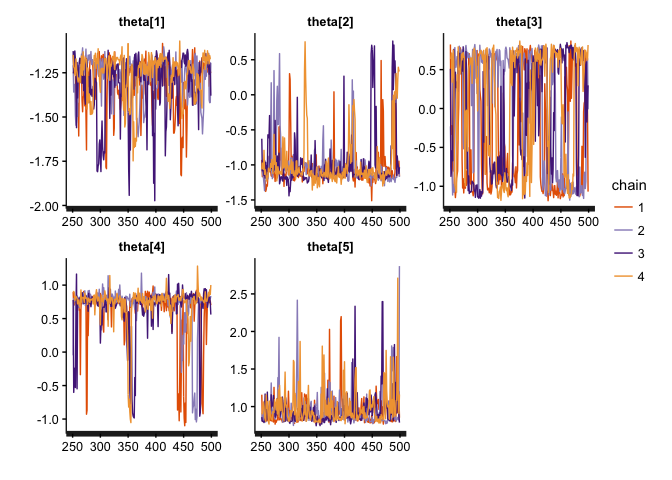

Purpose
-------

We're going to test the install of Stan & related packages by simulating some data, fitting a model to those data & evaluating the fit of the model.

Generating some fake data
-------------------------

``` r
n <- 30
theta <- 0.2
iter <- 500

set.seed(123)
y <- rbinom(n, size = 1, prob = theta)
```

Defining the model
------------------

This is a simple binomial model using Stan, which should correspond to our simulated data.

``` r
model_string <- "
data {
  int n;
  int y[n];
}

parameters {
  real<lower=0, upper=1> theta;
}

model {
  y ~ bernoulli(theta);
}

generated quantities {
  int yrep[n];
  real log_lik[n];
  
  for (i in 1:n) {
    yrep[i] <- bernoulli_rng(theta);
    log_lik[i] <- bernoulli_log(y[i], theta);
  }
}
"
```

Note that we've included a "generated quantities" block so that we can test *loo* & look at posterior predictive density.

Fitting the model in Stan
-------------------------

``` r
stan_samples <- stan(model_code = model_string,
                     iter = iter,
                     data = list(y = y, n = length(y))
                     )
```

    ## 
    ## SAMPLING FOR MODEL '26292587b725dc5b59f7d0f53f049ee0' NOW (CHAIN 1).
    ## 
    ## Chain 1, Iteration:   1 / 500 [  0%]  (Warmup)
    ## Chain 1, Iteration:  50 / 500 [ 10%]  (Warmup)
    ## Chain 1, Iteration: 100 / 500 [ 20%]  (Warmup)
    ## Chain 1, Iteration: 150 / 500 [ 30%]  (Warmup)
    ## Chain 1, Iteration: 200 / 500 [ 40%]  (Warmup)
    ## Chain 1, Iteration: 250 / 500 [ 50%]  (Warmup)
    ## Chain 1, Iteration: 251 / 500 [ 50%]  (Sampling)
    ## Chain 1, Iteration: 300 / 500 [ 60%]  (Sampling)
    ## Chain 1, Iteration: 350 / 500 [ 70%]  (Sampling)
    ## Chain 1, Iteration: 400 / 500 [ 80%]  (Sampling)
    ## Chain 1, Iteration: 450 / 500 [ 90%]  (Sampling)
    ## Chain 1, Iteration: 500 / 500 [100%]  (Sampling)# 
    ## #  Elapsed Time: 0.003505 seconds (Warm-up)
    ## #                0.00312 seconds (Sampling)
    ## #                0.006625 seconds (Total)
    ## # 
    ## 
    ## SAMPLING FOR MODEL '26292587b725dc5b59f7d0f53f049ee0' NOW (CHAIN 2).
    ## 
    ## Chain 2, Iteration:   1 / 500 [  0%]  (Warmup)
    ## Chain 2, Iteration:  50 / 500 [ 10%]  (Warmup)
    ## Chain 2, Iteration: 100 / 500 [ 20%]  (Warmup)
    ## Chain 2, Iteration: 150 / 500 [ 30%]  (Warmup)
    ## Chain 2, Iteration: 200 / 500 [ 40%]  (Warmup)
    ## Chain 2, Iteration: 250 / 500 [ 50%]  (Warmup)
    ## Chain 2, Iteration: 251 / 500 [ 50%]  (Sampling)
    ## Chain 2, Iteration: 300 / 500 [ 60%]  (Sampling)
    ## Chain 2, Iteration: 350 / 500 [ 70%]  (Sampling)
    ## Chain 2, Iteration: 400 / 500 [ 80%]  (Sampling)
    ## Chain 2, Iteration: 450 / 500 [ 90%]  (Sampling)
    ## Chain 2, Iteration: 500 / 500 [100%]  (Sampling)# 
    ## #  Elapsed Time: 0.003688 seconds (Warm-up)
    ## #                0.00317 seconds (Sampling)
    ## #                0.006858 seconds (Total)
    ## # 
    ## 
    ## SAMPLING FOR MODEL '26292587b725dc5b59f7d0f53f049ee0' NOW (CHAIN 3).
    ## 
    ## Chain 3, Iteration:   1 / 500 [  0%]  (Warmup)
    ## Chain 3, Iteration:  50 / 500 [ 10%]  (Warmup)
    ## Chain 3, Iteration: 100 / 500 [ 20%]  (Warmup)
    ## Chain 3, Iteration: 150 / 500 [ 30%]  (Warmup)
    ## Chain 3, Iteration: 200 / 500 [ 40%]  (Warmup)
    ## Chain 3, Iteration: 250 / 500 [ 50%]  (Warmup)
    ## Chain 3, Iteration: 251 / 500 [ 50%]  (Sampling)
    ## Chain 3, Iteration: 300 / 500 [ 60%]  (Sampling)
    ## Chain 3, Iteration: 350 / 500 [ 70%]  (Sampling)
    ## Chain 3, Iteration: 400 / 500 [ 80%]  (Sampling)
    ## Chain 3, Iteration: 450 / 500 [ 90%]  (Sampling)
    ## Chain 3, Iteration: 500 / 500 [100%]  (Sampling)# 
    ## #  Elapsed Time: 0.003731 seconds (Warm-up)
    ## #                0.003359 seconds (Sampling)
    ## #                0.00709 seconds (Total)
    ## # 
    ## 
    ## SAMPLING FOR MODEL '26292587b725dc5b59f7d0f53f049ee0' NOW (CHAIN 4).
    ## 
    ## Chain 4, Iteration:   1 / 500 [  0%]  (Warmup)
    ## Chain 4, Iteration:  50 / 500 [ 10%]  (Warmup)
    ## Chain 4, Iteration: 100 / 500 [ 20%]  (Warmup)
    ## Chain 4, Iteration: 150 / 500 [ 30%]  (Warmup)
    ## Chain 4, Iteration: 200 / 500 [ 40%]  (Warmup)
    ## Chain 4, Iteration: 250 / 500 [ 50%]  (Warmup)
    ## Chain 4, Iteration: 251 / 500 [ 50%]  (Sampling)
    ## Chain 4, Iteration: 300 / 500 [ 60%]  (Sampling)
    ## Chain 4, Iteration: 350 / 500 [ 70%]  (Sampling)
    ## Chain 4, Iteration: 400 / 500 [ 80%]  (Sampling)
    ## Chain 4, Iteration: 450 / 500 [ 90%]  (Sampling)
    ## Chain 4, Iteration: 500 / 500 [100%]  (Sampling)# 
    ## #  Elapsed Time: 0.003733 seconds (Warm-up)
    ## #                0.003519 seconds (Sampling)
    ## #                0.007252 seconds (Total)
    ## #

``` r
# summarize outcome of interest
print(stan_samples, pars = 'theta')
```

    ## Inference for Stan model: 26292587b725dc5b59f7d0f53f049ee0.
    ## 4 chains, each with iter=500; warmup=250; thin=1; 
    ## post-warmup draws per chain=250, total post-warmup draws=1000.
    ## 
    ##       mean se_mean   sd 2.5%  25%  50%  75% 97.5% n_eff Rhat
    ## theta 0.27       0 0.08 0.14 0.22 0.27 0.32  0.45   376 1.01
    ## 
    ## Samples were drawn using NUTS(diag_e) at Mon May  2 09:06:29 2016.
    ## For each parameter, n_eff is a crude measure of effective sample size,
    ## and Rhat is the potential scale reduction factor on split chains (at 
    ## convergence, Rhat=1).

Evaluating model fit
--------------------

### Review traceplot for theta - main parameter of interest

``` r
traceplot(stan_samples, pars = 'theta')
```

<!-- -->

### Review 50 & 95% posterior density for theta

``` r
plot(stan_samples, pars = 'theta')
```

<!-- -->

### Running LOO (leave-one-out validation)

[Loo](http://www.stat.columbia.edu/~gelman/research/unpublished/loo_stan.pdf) approximates leave-one-out validation, and can be used to identify observations with undue influence (leverage) on the model and/or for model comparison.

Here we are using it as a sanity check on our model fit.

``` r
loo(rstan::extract(stan_samples,'log_lik')$log_lik)
```

    ## Computed from 1000 by 30 log-likelihood matrix
    ## 
    ##          Estimate  SE
    ## elpd_loo    -18.4 2.6
    ## p_loo         1.0 0.2
    ## looic        36.8 5.2
    ## 
    ## All Pareto k estimates OK (k < 0.5)

### Posterior predictive checking

Finally, we compare distribution of simulated data (here using the mean of observations from each iteration) to that of observed values used to fit our model.

First we need to do some data manipulation to extract the values of interest from the stan object.

``` r
## note yrep is a matrix with dim = N post-warmup-samples X N obs
yrep <- rstan::extract(stan_samples, 'yrep')$yrep
colnames(yrep) <- seq(from = 1, to = n, by = 1)
rownames(yrep) <- seq(from = 1, to = iter*2, by = 1)

## summarize mean of samples from each iteration 
ysumm <- apply(yrep, MARGIN = 1, mean)
```

Now we can plot the parameters of interest

``` r
## plot density/histogram of iterations, to see how close we are to the truth
ggplot() + 
  geom_density(aes(x = ysumm)) +
  geom_vline(aes(xintercept = mean(y), colour = 'observed mean'))
```

<!-- -->

Note that the estimated samples are very close to our observed mean.

### Comparing estimated theta to true values

Next, since we are dealing with simulated data, we can compare the values of our estimated parameter (*theta*) to the true value used to generate the samples.

It's unlikely that the true value would be well outside our posterior distribution for theta, but it's possible.

``` r
thetahat <- unlist(rstan::extract(stan_samples, 'theta')$theta)

library(ggplot2)
ggplot() +
  geom_density(aes(x = thetahat, colour = 'estimated theta')) +
  geom_vline(aes(xintercept = theta, colour = 'true theta'))
```

<!-- -->
